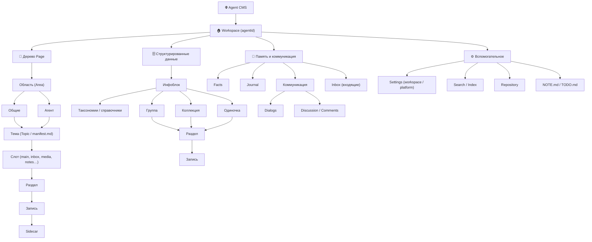

# Карта элементов workspace

```mermaid
flowchart TD
    CMS["🌐 Agent CMS"]
    WS["🏠 Workspace (agentId)"]

    CMS --> WS
    WS --> TREE["📁 Дерево Page"]
    WS --> DATA["🗄️ Структурированные данные"]
    WS --> MEM["🧠 Память и коммуникация"]
    WS --> AUX["⚙️ Вспомогательное"]

    TREE --> AREA["Область (Area)"]
    AREA --> SHARED_AREA["Общие"]
    AREA --> AGENT_AREA["Агент"]
    SHARED_AREA --> TOPIC["Тема (Topic / manifest.md)"]
    AGENT_AREA --> TOPIC
    TOPIC --> SLOT["Слот (main, inbox, media, notes…)"]
    SLOT --> SECTION["Раздел"]
    SECTION --> PAGE_ENTRY["Запись"]
    PAGE_ENTRY --> SIDECAR["Sidecar"]

    DATA --> IBLOCK["Инфоблок"]
    IBLOCK --> TAX["Таксономии / справочники"]
    IBLOCK --> GROUP["Группа"]
    IBLOCK --> COLLECTION["Коллекция"]
    IBLOCK --> SINGLE["Одиночка"]
    GROUP --> DATA_SECTION["Раздел"]
    COLLECTION --> DATA_SECTION
    SINGLE --> DATA_SECTION
    DATA_SECTION --> RECORD["Запись"]

    MEM --> FACTS["Facts"]
    MEM --> JOURNAL["Journal"]
    MEM --> COMM["Коммуникация"]
    COMM --> DIALOGS["Dialogs"]
    COMM --> DISCUSS["Discussion / Comments"]
    MEM --> INBOX["Inbox (входящие)"]

    AUX --> SETTINGS["Settings (workspace / platform)"]
    AUX --> SEARCH["Search / Index"]
    AUX --> REPO["Repository"]
    AUX --> BOARD["NOTE.md / TODO.md"]

    click CMS href "https://agent-cms.ru/" "Открыть сайт Agent CMS"
```
