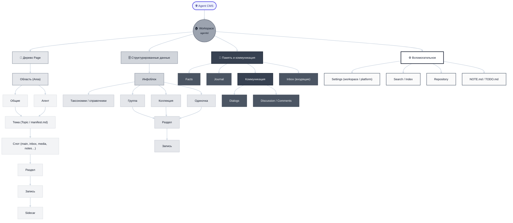

# Карта идей и элементов workspace

```mermaid
%%{init: {
  "theme": "base",
  "themeVariables": {
    "fontFamily": "ui-sans-serif, system-ui, -apple-system, BlinkMacSystemFont, Segoe UI, sans-serif",
    "fontSize": "14px",
    "lineColor": "#cbd5e1",
    "primaryTextColor": "#0f172a"
  },
  "flowchart": {
    "curve": "basis",
    "padding": 18,
    "nodeSpacing": 30,
    "rankSpacing": 46,
    "htmlLabels": true
  }
}}%%
flowchart TD
    CMS(["🌐 Agent CMS"])
    WS(("🏠 Workspace<br/><small>agentId</small>"))

    CMS --> WS
    WS --> TREE["📁 Дерево Page"]
    WS --> DATA["🗄️ Структурированные данные"]
    WS --> MEM["🧠 Память и коммуникация"]
    WS --> AUX["⚙️ Вспомогательное"]

    TREE --> AREA["Область (Area)"]
    AREA --> SHARED_AREA["Общие"]
    AREA --> AGENT_AREA["Агент"]
    SHARED_AREA --> TOPIC["Тема (Topic / manifest.md)"]
    AGENT_AREA --> TOPIC
    TOPIC --> SLOT["Слот (main, inbox, media, notes…)"]
    SLOT --> SECTION["Раздел"]
    SECTION --> PAGE_ENTRY["Запись"]
    PAGE_ENTRY --> SIDECAR["Sidecar"]

    DATA --> IBLOCK["Инфоблок"]
    IBLOCK --> TAX["Таксономии / справочники"]
    IBLOCK --> GROUP["Группа"]
    IBLOCK --> COLLECTION["Коллекция"]
    IBLOCK --> SINGLE["Одиночка"]
    GROUP --> DATA_SECTION["Раздел"]
    COLLECTION --> DATA_SECTION
    SINGLE --> DATA_SECTION
    DATA_SECTION --> RECORD["Запись"]

    MEM --> FACTS["Facts"]
    MEM --> JOURNAL["Journal"]
    MEM --> COMM["Коммуникация"]
    COMM --> DIALOGS["Dialogs"]
    COMM --> DISCUSS["Discussion / Comments"]
    MEM --> INBOX["Inbox (входящие)"]

    AUX --> SETTINGS["Settings (workspace / platform)"]
    AUX --> SEARCH["Search / Index"]
    AUX --> REPO["Repository"]
    AUX --> BOARD["NOTE.md / TODO.md"]

    classDef hub fill:#9ca3af,stroke:#6b7280,color:#111827,stroke-width:2px
    classDef cms fill:#eef2ff,stroke:#4f46e5,color:#312e81,stroke-width:2px
    classDef treeHead fill:#e5e7eb,stroke:#9ca3af,color:#111827,stroke-width:2px
    classDef treeNode fill:#f3f4f6,stroke:#d1d5db,color:#111827
    classDef dataHead fill:#d1d5db,stroke:#9ca3af,color:#111827,stroke-width:2px
    classDef dataNode fill:#e5e7eb,stroke:#b0b7c3,color:#111827
    classDef memHead fill:#374151,stroke:#1f2937,color:#f9fafb,stroke-width:2px
    classDef memNode fill:#4b5563,stroke:#374151,color:#f9fafb
    classDef auxHead fill:#ffffff,stroke:#0f172a,color:#0f172a,stroke-width:2.5px
    classDef auxNode fill:#fafafa,stroke:#334155,color:#0f172a,stroke-width:1.5px

    class CMS cms
    class WS hub
    class TREE,AREA treeHead
    class SHARED_AREA,AGENT_AREA,TOPIC,SLOT,SECTION,PAGE_ENTRY,SIDECAR treeNode
    class DATA,IBLOCK dataHead
    class TAX,GROUP,COLLECTION,SINGLE,DATA_SECTION,RECORD dataNode
    class MEM,COMM memHead
    class FACTS,JOURNAL,INBOX,DIALOGS,DISCUSS memNode
    class AUX auxHead
    class SETTINGS,SEARCH,REPO,BOARD auxNode

    linkStyle default stroke:#cbd5e1,stroke-width:2px

    click CMS href "https://agent-cms.ru/" "Открыть сайт Agent CMS"
```
