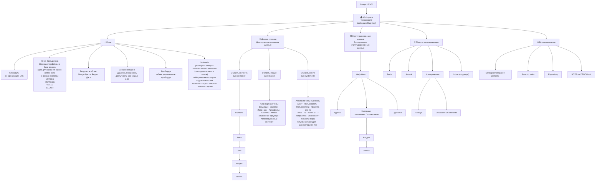

# Карта идей и элементов системы (workspace)

```mermaid
flowchart TD
    CMS["🌐 Agent CMS"]
    WS["🏠 Workspace<br/>workspaceID<br/>WorkspaceSlug (key)"]

    CMS --> WS
    WS --> TREE["📁 Дерево страниц<br/>Для изучения и анализа данных"]
    WS --> DATA["🗄️ Структурированные данные<br/>Для хранения структурированных данных"]
    WS --> MEM["🧠 Память и коммуникация"]
    WS --> AUX["⚙️ Вспомогательное"]
    WS --> IDEAS["💡 Идеи"]

    IDEAS --> IDEA1["Git-модуль<br/>синхронизация, LFS"]
    IDEAS --> IDEA2["UI на базе движка<br/>Сборка интерфейса на базе движка<br/>идеи для названия такого компонента<br/>в рамках системы:<br/>VOXELS<br/>VERTECX<br/>VEXEL<br/>ELEXIR"]
    IDEAS --> IDEA3["Выгрузка в облако<br/>Google Диск и Яндекс Диск"]
    IDEAS --> IDEA4["Синхронизация с удалённым сервером<br/>доступность хранилища 24/7"]
    IDEAS --> IDEA5["Дашборды<br/>гибкие управляемые дашборды"]
    IDEAS --> IDEA6["Пайплайн<br/>расширить статусы записей через пайплайны<br/>(последовательность шагов)<br/>либо дополнить статусы отдельным полем<br/>базовые статусы: открыто · закрыто · архив"]

    TREE --> SHARED_AREA["Область общие<br/>awn-shared"]
    TREE --> CONTENT_AREA["Область контента<br/>awn-container"]
    TREE --> AGENT_AREA["Область агента<br/>awn-system / kit"]

    CONTENT_AREA --> AREA["Область"]
    AREA --> TOPIC["Тема"]
    TOPIC --> SLOT["Слот"]
    SLOT --> SECTION["Раздел"]
    SECTION --> PAGE_ENTRY["Запись"]

    SHARED_AREA --> SHARED_THEMES["Стандартные темы<br/>Входящие · Заметки · Источники · Артефакты · Скрипты · Медиа<br/>Загрузки из браузера · Автозагружаемый контекст"]

    AGENT_AREA --> AGENT_SVC["Агентские темы и ресурсы<br/>Агент · Пользователь · Пользователи · Правила агента<br/>Голос TTS · Голос STT · Устройства · Экзоскелет · Объекты мира<br/>Случайный анекдот — для экспериментов"]

    DATA --> IBLOCK["Инфоблок"]
    IBLOCK --> GROUP["Группа"]
    IBLOCK --> COLLECTION["Коллекция<br/>таксономии / справочники"]
    IBLOCK --> SINGLE["Одиночка"]
    COLLECTION --> DATA_SECTION["Раздел"]
    DATA_SECTION --> RECORD["Запись"]

    MEM --> FACTS["Facts"]
    MEM --> JOURNAL["Journal"]
    MEM --> COMM["Коммуникация"]
    COMM --> DIALOGS["Dialogs"]
    COMM --> DISCUSS["Discussion / Comments"]
    MEM --> INBOX["Inbox (входящие)"]

    AUX --> SETTINGS["Settings (workspace / platform)"]
    AUX --> SEARCH["Search / Index"]
    AUX --> REPO["Repository"]
    AUX --> BOARD["NOTE.md / TODO.md"]

    click CMS href "https://agent-cms.ru/" "Открыть сайт Agent CMS"
```
