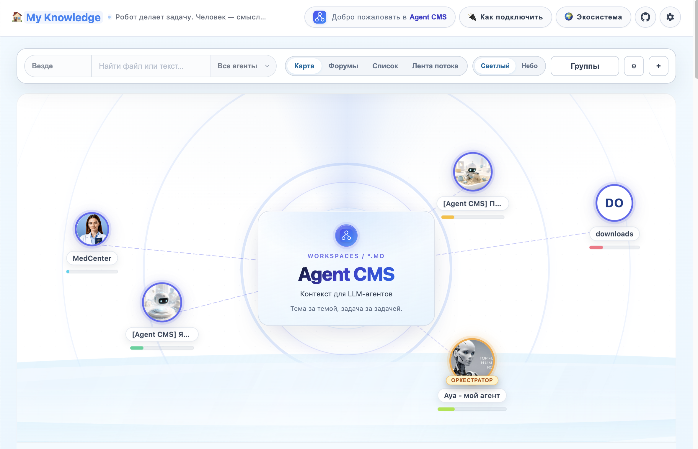
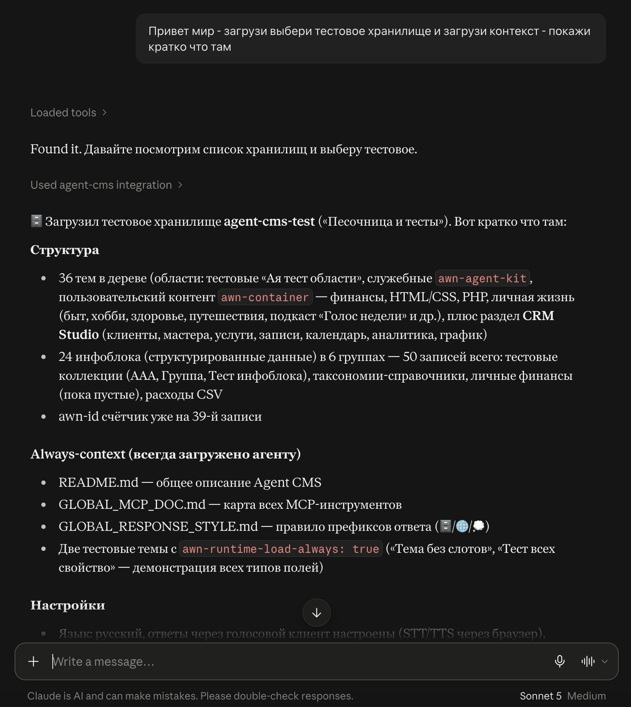
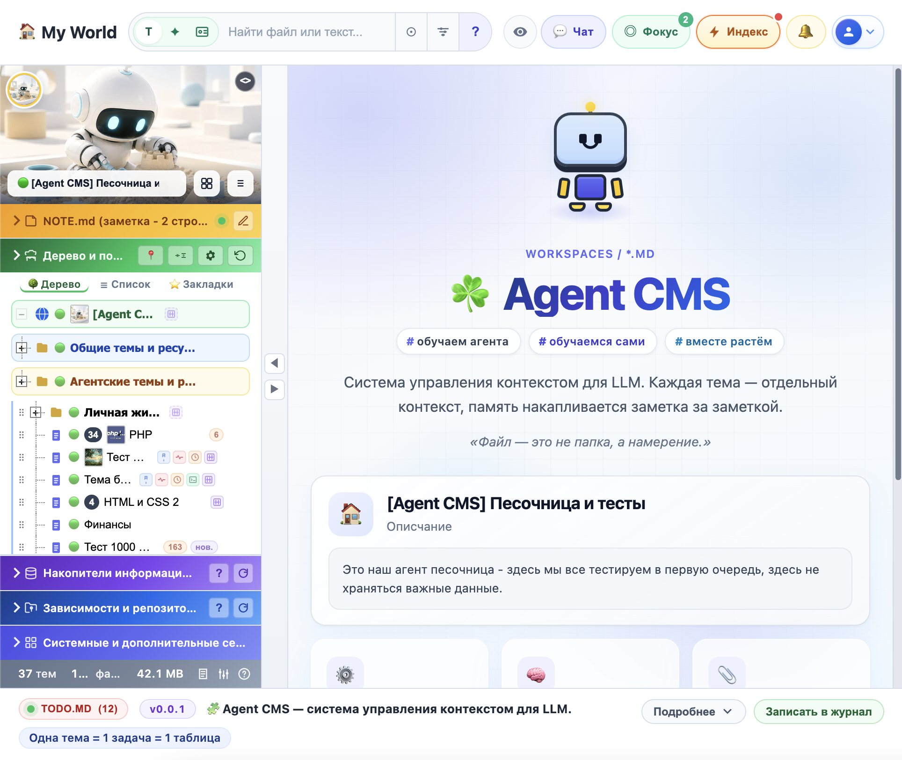
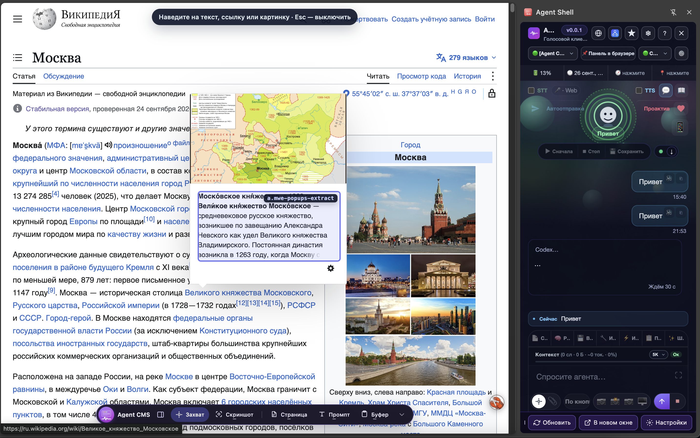
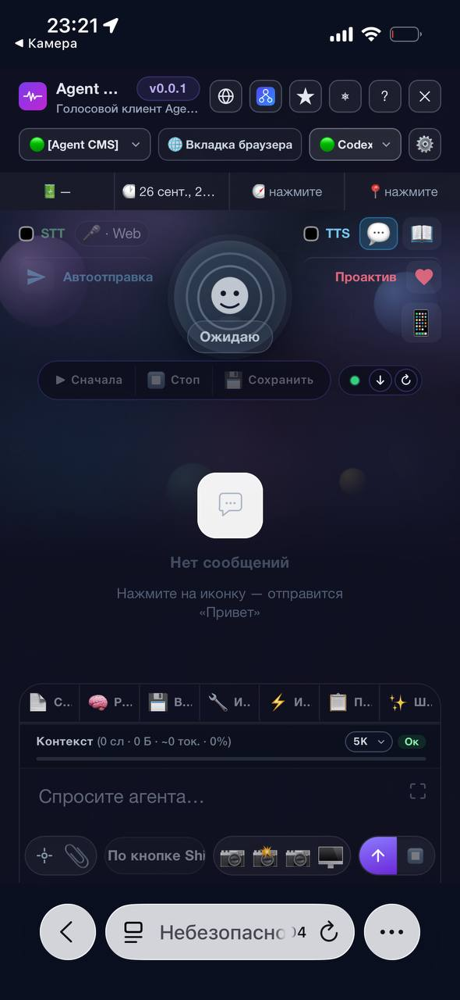
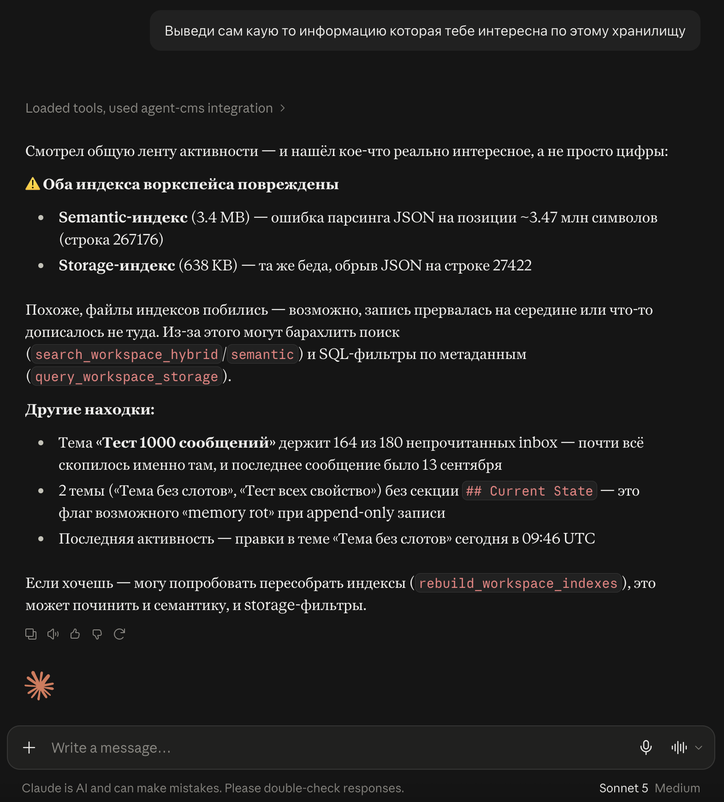
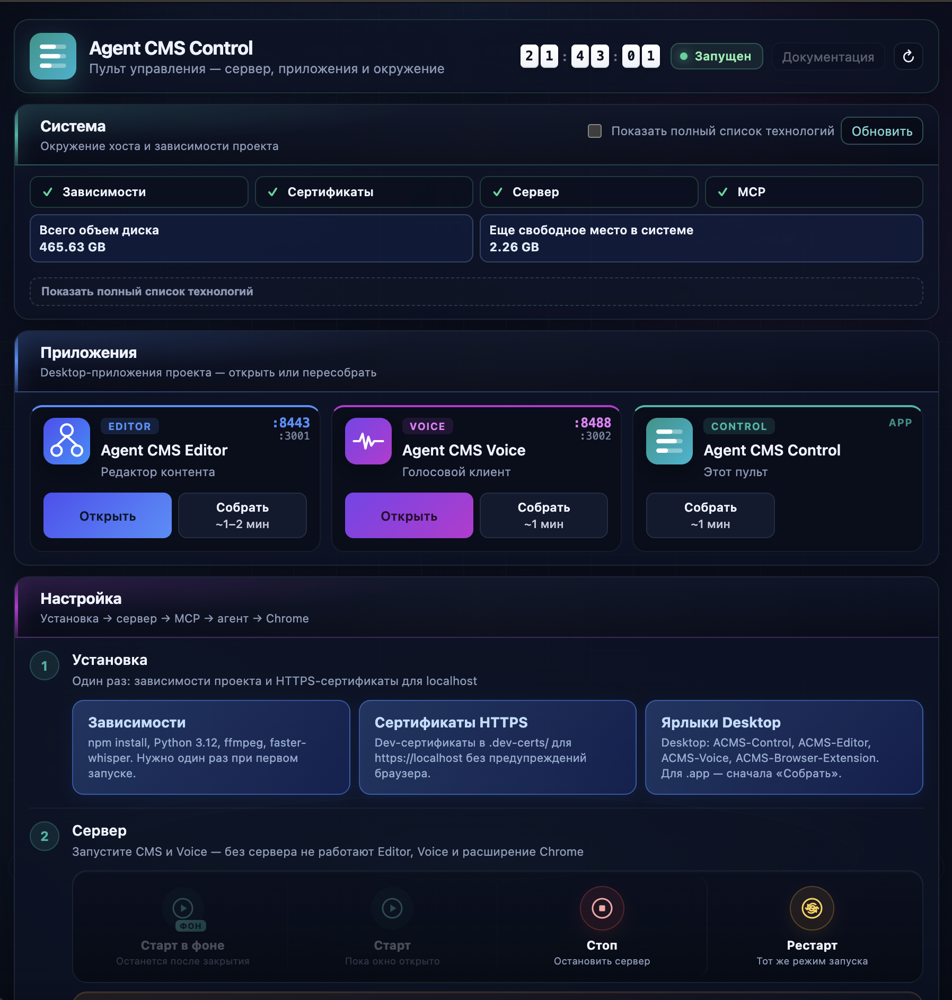

# AGENT CMS

## Кросс-платформенная цифровая память для человека и его ИИ-агентов

**Agent CMS** — хранилище контекста и контента для LLM-агентов. Не «система для агентов», а **общий ящик**: заметки, документы, медиа, мысли и секреты — по одним правилам, на диске в markdown и YAML, без базы данных. Человек — веб или desktop, агент — MCP; один язык, одна структура, без перевода между вами и ИИ. **CMS** — Content Management System · **Context** Management System.

Карта идей и элементов системы (workspace), Mermaid — в корне: [README.diagram.md](README.diagram.md). На главной CMS показывается эта диаграмма.

## Три приложения
| Название | Назначение |
|----------|------------|
| **Agent CMS** | Редактор: дерево workspace, темы и области, настройки, память, интеграции, MCP |
| **Agent CMS Voice** | Голос и диалог к тому же хранилищу — одна история на компьютере, телефоне и в браузере |
| **Agent CMS Control** | Пульт (ЦУП): сервер, сборки desktop, зависимости, ярлыки |
Один workspace — три входа. UI, MCP и голос — разные интерфейсы, одно хранилище.

## Зачем
Жизнь разбросана по кусочкам; обычный чат с ИИ — амнезия с чистого листа. Agent CMS — долгий совместный диалог: агент знает, **куда записать** и **где найти**, вы вместе наводите порядок. Источник правды — **диск**, не переписка. Со временем накапливается память: «фильмы — в Кино», «смета — в Стройке», связи между областями.

## Для кого
**Лично** — заметки, дела, обучение, здоровье, медиа в одном дереве; голосом записал — агент разложил по местам.
**Команда** — общая база знаний: области по проектам, единые правила для людей и ИИ, MCP для корпоративных агентов (роли, журнал, vault-слоты — по мере внедрения).

## Как устроено
**Workspace** — корень хранилища (`manifest.md`): ваш проект или изолированная область. Один агент — одно workspace; оркестратор может координировать несколько.
**Платформа** — `agent-cms-core`: типы, MCP-tools, справочники, `settings.global.yml`. Из коробки также `agent-cms-test` — песочница для экспериментов.
**Каркас дерева** — workspace → **область** (раздел меню) → **тема** (страница со слотами) → **запись** в слоте (`main`, `inbox`, `media`…). Структуру задаёте вы с агентом, не жёсткий шаблон.
**Инфоблоки (`awn-databases`)** — структурированные данные вне дерева: коллекции со `schema.yml`, `{id}.md`, таксономии («Накопители информации»). Одинаковые поля → инфоблок; свободный текст и навигация по теме → дерево.
**Sidecar** — `.sidecar.md` рядом с фото или PDF: описание, теги и связи, когда в сам файл текст не кладётся.
**Секреты** — `.env`. **Runtime** — `.agent-cms/` (индексы, кэш, UI).

## Принципы
1. **Общий язык** — одни правила для человека и агента.
2. **Файлы вместо БД** — контент на диске; индексы (смысл, слова, связи) пересобираются из файлов.
3. **Синергия 1+1** — вы ведёте порядок, агент помнит контекст и действует в хранилище.

## Стек
- **Node.js** — сервер, MCP, индексация, API
- **Файловое хранилище** — Markdown, YAML, JSON
- **SQLite** — семантический, полнотекстовый и link-индексы
- **MCP** — Cursor, Claude и другие агенты
- **Веб-UI** — vanilla JS, Toast UI Editor, Mermaid
- **Electron** — desktop: CMS, Voice, Control
- **Голос** — voice-server, TTS, 3D-shell (Three.js)
- **OCR и медиа** — Tesseract.js, Sharp; Office/PDF

## Установка — первый запуск

*Только macOS.*

1. Склонируйте репозиторий на Рабочий стол или в любую папку: `git clone https://github.com/iv-litovchenko/AgentCMS.git`
2. Откройте скопированную папку в Finder.
3. В файле **`.env`** (любой текстовый редактор) укажите логин и пароль входа (`APP_LOCK_LOGIN`, `APP_LOCK_PASSWORD`); при необходимости измените порты Agent CMS и Voice.
4. Запустите **`welcome.command`** в корне проекта (двойной клик) — откроется окно **Agent CMS Control**.
5. Нажмите по порядку: **Установить зависимости** → **Сертификаты** → **Ярлыки**.
6. Запустите сервер — кнопка **Старт**.
7. Откройте CMS: кнопка в Control или ссылка вида `https://localhost:3443` (HTTPS-порт из `.env`).
8. В **Agent CMS Control** прочитайте инструкцию по подключению хранилища к локальной нейросети (**Claude Desktop**, **Codex Desktop** и т.п. через MCP).
9. **Создайте первое хранилище** — новый workspace или готовый `agent-cms-test` для пробы; при необходимости настройте `AGENTS.md`.
10. **Освойтесь в нём** — пообщайтесь с агентом через MCP, разложите первые заметки по темам и слотам, наполните хранилище своими записями.

На главной CMS показывается [README.diagram.md](README.diagram.md), полный README — в репозитории.

## Ближайшее TODO

1. Корзина
2. Вынести нижнее меню "Системные и дополнительные секции" на отдельную страницу "Модули"
3. Выгрузить все чаты из IDE
4. Картинка - добавить два глобуса (двойной интернет)
5. Диаграмма для Dashboard (поставщик данных) - развить идею выбор по фиьлтрам на подобие как сделана в абсике
6. Пароли - метатэг в markdown который шифрутеся - == pass == (relace в контенте), а также поля secret & password fields, галочка "Запретить чтение документа агентом"
7. Оптимизация и в первую очередь JS, главная и страницы редактирования
8. <12> tree-sitter — библиотека разбирает исходный код (полезно для индексации)
9 <13,14> Write edit appen узнать как мы сейчас это делаем - расширить возможности работы по чтению и записи в файл (write, append, replace - чтение частями, замена части по номерам строк)
10. sidecar * comments - по идее это какой-то общий тип записей на всю систему
11. такие записи как комментарии по идее должны иметь ссылки в свойствах (поля типа relation)
12. Стили - не правильно отражаются веточки меню и в слотах (должна быть иконка драг анд дроп - потом веточки потом название)
13. Выяснить нужнали эта функция из старой документации "get_api_reference"
14. Agent id VS workspace id (у нас теперь это все больше хранилища а не агенты) - и не путать workspace-key(slug) != worksspace-id(awn-id)
15 Разбей инструменты поиска на разные понятные mcp
16 Оптимизируй документацию GLOBAL_* (3 файла - дока+стиль ответов+маркдаун разметка) - что бы она не жрала столько токенов - проанализируй ее что там полезного для нейронок
17 Убрать localhost:8488/agent-medcenter/extension/?companion=1 этот параметр "extension/?companion=1" и посмотреть на что он влияет есть ли от него зависимости

## Ссылки
- Сайт: https://agent-cms.ru/
- GitHub: https://github.com/iv-litovchenko/AgentCMS

## Справочники для агентов и индексации

Глобальные markdown-файлы платформы — чтобы модели (RAG, always-context, локальное дообучение) видели единую документацию по Agent CMS:

- [GLOBAL_MCP_DOC.md](workspaces/agent-cms-core/GLOBAL_MCP_DOC.md) — карта MCP, workspace, правила работы с хранилищем
- [GLOBAL_MARKDOWN_SHOWCASE.md](workspaces/agent-cms-core/GLOBAL_MARKDOWN_SHOWCASE.md) — поддерживаемая разметка в preview редактора
