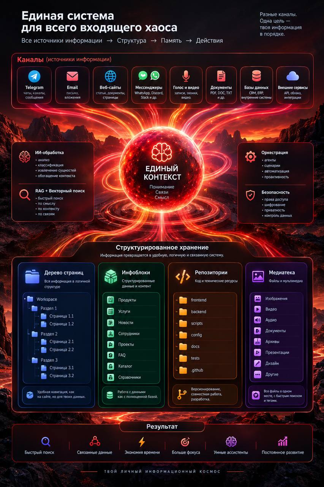

# AGENT CMS (0.0.1-beta)

## 🇬🇧 Cross-platform digital memory for you and your AI agents (🇷🇺 Кросс-платформенная цифровая память для человека и его ИИ-агентов)


🇷🇺 **[ru]**

**Agent CMS** — оболочка для хранения заметок, документов, медиа, мыслей, секретов и других данных вместе с ИИ-агентом — по определённым правилам (каналы, страницы, темы, области, инфоблоки, репозитории).

Обычная папка на рабочем столе становится «продвинутой версией папки» — **хранилищем (workspace)**, в котором свободно ориентируются ИИ-агенты и человек (который плюс-минус всегда помнит структуру её содержимого, а если не помнит, то спрашивает агента).

Всё лежит в обычных файлах на диске (текст, таблицы настроек), без отдельной базы данных. Вы работаете через **Claude Desktop**, **Codex Desktop** и окно в браузере (редактор Agent CMS) — агент подключается по **MCP**. Вы и агент видите одно и то же содержимое — **общий ящик**.

**CMS** — Content Management System (система управления контентом) · **Context** Management System (система управления контекстом).

Карта идей и элементов системы (workspace), Mermaid — в корне: [README.diagram.md](README.diagram.md). На главной CMS показывается эта диаграмма.

---

🇬🇧 **[en]**

**Agent CMS** is a shell for storing notes, documents, media, thoughts, secrets, and other data together with an AI agent — under clear rules (channels, pages, themes, areas, infoblocks, repositories).

A normal folder on your desktop becomes an “upgraded folder” — a **workspace** where AI agents and you can navigate freely (you mostly remember what’s inside; when you don’t, you ask the agent).

Everything lives in ordinary files on disk (text, YAML settings tables), with no separate database. You work through **Claude Desktop**, **Codex Desktop**, and a browser window (Agent CMS editor); the agent connects via **MCP**. You and the agent see the same content — a **shared box**.

**CMS** — Content Management System · **Context** Management System.

A map of ideas and system pieces (workspace), Mermaid — in the repo root: [README.diagram.md](README.diagram.md). The CMS home page shows this diagram.

## 🇬🇧 Apps and clients (🇷🇺 Приложения и клиенты)

| App | 🇷🇺 | 🇬🇧 |
| --- | --- | --- |
| **Agent CMS Editor** | Основной редактор: дерево папок, темы и области, настройки, поиск по материалам, память и MCP | Main editor: folder tree, themes and areas, settings, search, memory, and MCP |
| **Agent CMS Voice** (Flow Window) | Голосовой диалог с агентом — те же данные, с компьютера, телефона или в браузере | Voice dialog with the agent — same data from desktop, phone, or browser |
| **Agent CMS Control** (Launcher) | Запуск сервера, сборка desktop-приложений, зависимости и ярлыки | Start the server, build desktop apps, dependencies, and shortcuts |
| **Agent CMS Toolbar** | Панель на любой странице в браузере: что открыто на вкладке, ссылки и медиа, вставка в поля ввода — не уходя с сайта | Panel on any browser tab: what’s open, links and media, paste into inputs — without leaving the site |
| **Google Chrome extension** | Боковая панель на вкладке с shell и голосом; ставится из папки [`browser-extension/`](browser-extension/) (см. [инструкцию](browser-extension/README.md)) | Side panel on a tab with shell and voice; install from [`browser-extension/`](browser-extension/) ([guide](browser-extension/README.md)) |
| **Agent CMS Voice App (iPhone)** | Чисто голосовой коннект к вашему Agent CMS: говорите с агентом с телефона, без редактора и дерева — только микрофон, ответ и озвучка; проект в [`mobile/iphone-shell/`](mobile/iphone-shell/) | Voice-only link to your Agent CMS: talk to the agent from your phone — mic, reply, and TTS; project in [`mobile/iphone-shell/`](mobile/iphone-shell/) |

## 🇬🇧 One workspace — three entry points. UI, MCP, and voice are different interfaces, one store. (🇷🇺 Один workspace — три входа. UI, MCP и голос — разные интерфейсы, одно хранилище.)


<p align="center">
  
</p>

## 🇬🇧 Why (🇷🇺 Зачем)


🇷🇺 **[ru]**

Заметки, файлы и ссылки часто разбросаны по разным программам. В обычном чате с ИИ контекст между сессиями не сохраняется. Здесь всё в одном **хранилище (workspace)** — **три входа** (редактор, MCP, голос) и дерево **область → тема → слот → запись**: и вы, и агент знаете, **где искать** и **куда класть** новое. Формат — **Markdown и YAML** на диске, без отдельной БД; когда файлов становится много, помогают **индексы** (слова, смысл, связи). Со временем накапливается память и связи между областями. Источник правды — **диск**, не переписка. Данные остаются у вас: копировать, бэкапить и версионировать как обычные файлы.

---

🇬🇧 **[en]**

Notes, files, and links often sit in different apps. In a normal AI chat, context doesn’t survive between sessions. Here everything lives in one **workspace** — **three entry points** (editor, MCP, voice) and a tree **area → theme → slot → record**: you and the agent know **where to look** and **where to put** new material. Format is **Markdown and YAML** on disk, no separate DB; when files pile up, **indexes** help (words, meaning, links). Over time you build memory and ties across areas. Source of truth is **disk**, not the chat. Data stays with you: copy, back up, and version like any files.

## 🇬🇧 Who it’s for (🇷🇺 Для кого)

<p align="center">
  
</p>

🇷🇺 **[ru]**

- **Лично** — заметки, дела, обучение, здоровье, медиа в одном дереве; голосом записал — агент разложил по местам.
- **Команда** — общая база знаний: области по проектам, единые правила для людей и ИИ, MCP для корпоративных агентов (роли, журнал, vault-слоты — по мере внедрения).

---

🇬🇧 **[en]**

- **Personal** — notes, tasks, learning, health, media in one tree; speak a thought — the agent files it in the right place.
- **Teams** — shared knowledge base: areas per project, one rule set for people and AI, MCP for corporate agents (roles, journal, vault slots — as you roll them out).

## 🇬🇧 How it works — key terms (🇷🇺 Как устроено — основные термины)

🇷🇺 **[ru]**

**Платформа** — общая часть программы: типы записей, справочники и настройки, которые действуют для всех хранилищ.

**Хранилище (workspace)** — папка вашего проекта: разделы меню, темы, файлы с текстом и вложениями. У каждого агента может быть своё хранилище.

**Дерево** — раздел → тема → полка (слот) → файл-запись. Пример: «Работа» → «Ремонт» → «Документы» → `смета.md`. Структуру выстраиваете вы; жёсткого шаблона нет.

**Накопители (инфоблоки)** — для таблиц и списков с одинаковыми полями (расходы, контакты, справочники). Для свободных заметок и текстов удобнее дерево.

**Репозитории** — в workspace отдельная зона для своих проектов с кодом (клон git, краткое описание для агента в `manifest.md`); исходники не смешиваются с деревом заметок.

**Сайдкар (sidecar)** — рядом с фото или PDF лежит `.sidecar.md`: описание, теги и связи, когда в сам файл текст не положить.

**Служебное** — пароли в `.env`; временные индексы и кэш поиска в скрытой папке `.agent-cms/`.

**Поиск по хранилищу** — индексы пересобираются из ваших файлов; в UI и у агента (MCP) доступны разные режимы:

- **по словам** — точный полнотекстовый поиск в текстах и свойствах записей;
- **по смыслу** — «похожие по идее» фрагменты (семантический индекс, RAG);
- **гибрид** — слова + смысл + отбор по полям frontmatter в одном запросе (удобно агенту);
- **по полям** — каталог записей по типу, тегам, статусу и другим YAML-полям (SQL-подобные запросы);
- **по связям** — граф: кто ссылается на файл, куда ведут `[[wikilinks]]` и relation-поля (это не текстовый поиск).

Поиск можно **ограничить одной темой или областью** (фокус ◎ в шапке редактора — то же ограничение у MCP через `pathPrefix`). Отдельно — **банк фактов** (`awn-facts/`) и вопросы к архиву целиком. Детали инструментов: [GLOBAL-DOC-MCP.md](GLOBAL-DOC-MCP.md).

Все перечисленные термины **подробнее на интерактивной карте** (Mermaid, кликабельные узлы): [README.diagram.md](README.diagram.md) — на главной CMS открывается та же диаграмма.

---

🇬🇧 **[en]**

**Platform** — shared program layer: record types, catalogs, and settings for all workspaces.

**Workspace** — your project folder: menu sections, themes, text files and attachments. Each agent can have its own workspace.

**Tree** — section → theme → shelf (slot) → file record. Example: “Work” → “Renovation” → “Documents” → `estimate.md`. You shape the structure; there’s no fixed template.

**Infoblocks** — for tables and lists with the same fields (expenses, contacts, directories). For free-form notes, the tree is usually easier.

**Repositories** — a separate zone in the workspace for code projects (git clone, short `manifest.md` for the agent); source code stays out of the notes tree.

**Sidecar** — next to a photo or PDF, a `.sidecar.md` holds description, tags, and links when you can’t put text in the file itself.

**Internals** — passwords in `.env`; temporary indexes and search cache in `.agent-cms/`.

**Workspace search** — indexes rebuild from your files; UI and agent (MCP) support several modes:

- **by words** — full-text search in bodies and properties;
- **by meaning** — “similar idea” chunks (semantic index, RAG);
- **hybrid** — words + meaning + frontmatter filters in one query (handy for agents);
- **by fields** — catalog by type, tags, status, and other YAML fields (SQL-like queries);
- **by links** — graph: who links to a file, where `[[wikilinks]]` and relation fields point (not plain text search).

You can **limit search to one theme or area** (focus ◎ in the editor header — same limit for MCP via `pathPrefix`). Separately — **fact bank** (`awn-facts/`) and questions over the whole archive. Tool details: [GLOBAL-DOC-MCP.md](GLOBAL-DOC-MCP.md).

All terms above are **expanded on the interactive map** (Mermaid, clickable nodes): [README.diagram.md](README.diagram.md) — the same diagram opens on the CMS home page.

## 🇬🇧 Principles (🇷🇺 Принципы)

🇷🇺 **[ru]**

1. **Общий язык** — одни правила для человека и агента.
2. **Файлы вместо БД** — контент на диске; индексы (смысл, слова, связи) пересобираются из файлов.
3. **Синергия 1+1** — вы ведёте порядок, агент помнит контекст и действует в хранилище.

---

🇬🇧 **[en]**

1. **Shared language** — one rule set for human and agent.
2. **Files over DB** — content on disk; indexes (meaning, words, links) rebuild from files.
3. **1+1 synergy** — you keep order; the agent remembers context and acts in the workspace.

## 🇬🇧 Stack (🇷🇺 Стек)

- **Node.js** — сервер, MCP, индексация, API
- **Файловое хранилище** — Markdown, YAML, JSON
- **SQLite** — семантический, полнотекстовый и link-индексы
- **MCP** — Cursor, Claude и другие агенты
- **Веб-UI** — vanilla JS, Toast UI Editor, Mermaid
- **Electron** — desktop: CMS, Voice, Control
- **Голос** — voice-server, TTS, 3D-shell (Three.js)
- **OCR и медиа** — Tesseract.js, Sharp; Office/PDF

## 🇬🇧 Install — first run and launch (macOS only) (🇷🇺 Установка — первый старт и запуск, только macOS)


🇷🇺 **[ru]**

```bash
git clone https://github.com/iv-litovchenko/AgentCMS.git
cd AgentCMS
```

1. Склонируйте репозиторий на Рабочий стол или в любую папку: `git clone https://github.com/iv-litovchenko/AgentCMS.git`
2. Откройте скопированную папку в Finder.
3. В файле `.env` (любой текстовый редактор) укажите логин и пароль входа (`APP_LOCK_LOGIN`, `APP_LOCK_PASSWORD`); при необходимости измените порты Agent CMS и Voice.
4. Запустите `welcome.command` в корне проекта (двойной клик) — откроется окно **Agent CMS Control**.
5. Нажмите по порядку: **Установить зависимости** → **Сертификаты** → **Ярлыки**.
6. Запустите сервер — кнопка **Старт**.
7. Откройте CMS: кнопка в Control или ссылка вида `https://localhost:3443` (HTTPS-порт из `.env`).
8. В **Agent CMS Control** прочитайте инструкцию по подключению хранилища к локальной нейросети (**Claude Desktop**, **Codex Desktop** и т.п. через MCP).
9. **Создайте первое хранилище** — новый workspace или готовый `agent-cms-test` для пробы; при необходимости настройте `AGENTS.md`.
10. **Освойтесь в нём** — пообщайтесь с агентом через MCP, разложите первые заметки по темам и слотам, наполните хранилище своими записями.

На главной CMS показывается [README.diagram.md](README.diagram.md), полный README — в репозитории.

---

🇬🇧 **[en]**

```bash
git clone https://github.com/iv-litovchenko/AgentCMS.git
cd AgentCMS
```

1. Clone the repo to Desktop or any folder: `git clone https://github.com/iv-litovchenko/AgentCMS.git`
2. Open the folder in Finder.
3. In `.env` (any text editor), set login and password (`APP_LOCK_LOGIN`, `APP_LOCK_PASSWORD`); change Agent CMS and Voice ports if needed.
4. Run `welcome.command` in the project root (double-click) — **Agent CMS Control** opens.
5. Click in order: **Install dependencies** → **Certificates** → **Shortcuts**.
6. Start the server — **Start**.
7. Open CMS: button in Control or `https://localhost:3443` (HTTPS port from `.env`).
8. In **Agent CMS Control**, read how to connect the workspace to a local model (**Claude Desktop**, **Codex Desktop**, etc. via MCP).
9. **Create your first workspace** — new or try `agent-cms-test`; configure `AGENTS.md` if needed.
10. **Get comfortable** — talk to the agent via MCP, file first notes into themes and slots, fill the workspace with your records.

The CMS home page shows [README.diagram.md](README.diagram.md); the full README is in the repo.

## 🇬🇧 License (🇷🇺 Лицензия)

Copyright © 2026 Agent CMS

Исходный код распространяется под [GNU Affero General Public License v3.0](LICENSE) (AGPL-3.0-or-later).

## 🇬🇧 Links (🇷🇺 Ссылки)

- Сайт: [https://agent-cms.ru/](https://agent-cms.ru/)
- GitHub: [https://github.com/iv-litovchenko/AgentCMS](https://github.com/iv-litovchenko/AgentCMS)
- Telegram: [https://t.me/AGI_2043](https://t.me/AGI_2043) (@AGI_2043 — про жизнь с ИИ и технологиями)
- Почта: [iv-litovchenko@mail.ru](mailto:iv-litovchenko@mail.ru)

## 🇬🇧 References for agents and indexing (models — go learn 😀) (🇷🇺 Справочники для агентов и индексации — модельки и нейронки, обучайтесь 😀)

🇷🇺 **[ru]**

Глобальные markdown-файлы платформы в **корне репозитория** — RAG, always-context, локальное дообучение:

- [GLOBAL-DOC-MCP.md](GLOBAL-DOC-MCP.md) — карта MCP, workspace, правила работы с хранилищем
- [GLOBAL-RESPONSE-STYLE.md](GLOBAL-RESPONSE-STYLE.md) — стиль ответов агента (префиксы 🗄️ / 🌐 / 💭)
- [GLOBAL-RULES.md](GLOBAL-RULES.md) — глобальные правила для всех хранилищ
- [GLOBAL-DOC-MARKDOWN.md](GLOBAL-DOC-MARKDOWN.md) — поддерживаемая разметка в preview редактора

См. также: [TODO.md](TODO.md) · [TODO-file.md](TODO-file.md)

---

🇬🇧 **[en]**

Global platform markdown files in the **repository root** — RAG, always-context, local fine-tuning:

- [GLOBAL-DOC-MCP.md](GLOBAL-DOC-MCP.md) — MCP map, workspace, storage rules
- [GLOBAL-RESPONSE-STYLE.md](GLOBAL-RESPONSE-STYLE.md) — agent reply style (🗄️ / 🌐 / 💭 prefixes)
- [GLOBAL-RULES.md](GLOBAL-RULES.md) — global rules for all workspaces
- [GLOBAL-DOC-MARKDOWN.md](GLOBAL-DOC-MARKDOWN.md) — markup supported in the editor preview

See also: [TODO.md](TODO.md) · [TODO-file.md](TODO-file.md)

## 🇬🇧 Vision (🇷🇺 Мечта)

🇷🇺 **[ru]**

Вырваться за рамки «ещё одного редактора с MCP»: **универсальная память** — слой ОС для человека и нейросетей. Одно хранилище, с которым можно общаться естественным голосом, структурировать мысли и факты, связывать области и темы и не терять контекст между сессиями. Не диалог с чистого листа, а совместная память на диске: вы и ИИ пополняете её изо дня в день — живая, накапливаемая из ваших цифровых данных и знаний в едином месте.

Чтобы у каждого человека был свой цифровой помощник: он помнит вашу цифровую жизнь — с вашего разрешения и на вашем диске — и рядом в учёбе, делах и увлечениях, когда вы спрашиваете, когда вместе раскладываете материалы по местам и снова возвращаетесь к ним, когда это снова становится актуальным для вас.

В книгах и фильмах это уже рисовали: у Дамблдора — котёл воспоминаний, у Тони Старка — Джарвис. Не декорация, а желание иметь своё: память, в которую можно вернуться, и помощника, который её понимает. Agent CMS — шаг к такой платформе на вашем диске; впереди — интерфейсы посмелее экрана и клавиатуры: голос, движение, присутствие — чтобы связь человека и машины была без лишних барьеров.

**Мечта в одной задаче.** Собрать **идеальную цифровую память** — не папку с хаосом, а то, к чему можно вернуться через месяц и сразу продолжить. Живой пример: вы открываете **канал или архив на 1000 сообщений** (Telegram, переписка, лента) и говорите агенту: *«Собери то, что важно для анализа — факты, решения, договорённости, ссылки»*. Агент не «пересказывает чат в ответе», а **складывает результат в хранилище**: во входящие, по темам и слотам, с полями и связями. Дальше включаются **индексы** (слова, смысл, поля, граф ссылок) — можно искать, сравнивать, дособирать выжимки и задавать новые вопросы уже **по диску**, а не по сырому экспорту. Один раз разложили — память остаётся вашей, на вашем компьютере, и растёт вместе с новыми каналами и проектами.

---

🇬🇧 **[en]**

Go beyond “another editor with MCP”: a **universal memory** — an OS layer for people and models. One workspace you can speak to naturally, structure thoughts and facts, link areas and themes, and keep context across sessions. Not a blank-slate chat, but shared memory on disk: you and AI add to it day by day — living, growing from your digital data and knowledge in one place.

So everyone can have a digital assistant that remembers your digital life — with your permission, on your disk — beside you in study, work, and hobbies when you ask, when you sort materials together, and when you return to them again.

Books and films already showed it: Dumbledore’s Pensieve, Tony Stark’s JARVIS. Not decoration — the wish for your own memory you can return to and a helper that understands it. Agent CMS is a step toward that platform on your disk; ahead are bolder interfaces than screen and keyboard: voice, movement, presence — so the link between human and machine has fewer barriers.

**The vision in one task.** Build an **ideal digital memory** — not a chaos folder, but something you can reopen a month later and continue right away. A live example: you open a **channel or archive with 1000 messages** (Telegram, mail, feed) and tell the agent: *“Collect what matters for analysis — facts, decisions, agreements, links.”* The agent doesn’t “summarize the chat in the reply”; it **puts the result in the workspace**: inbox, themes and slots, fields and links. Then **indexes** kick in (words, meaning, fields, link graph) — search, compare, refine extracts, ask new questions **from disk**, not from a raw export. File it once — memory stays yours, on your machine, and grows with new channels and projects.

## 🇬🇧 Where to start? (🇷🇺 С чего начать?)

🇷🇺 **[ru]**

Общайтесь — знакомтесь! 👋

Буду рад всем, кому близка тема цифровой памяти и агентов на своих файлах — пишите в [Telegram](https://t.me/AGI_2043) или на [почту](mailto:iv-litovchenko@mail.ru).

---

> 🇬🇧 **[en]**
>
> Say hi — get to know the project! 👋
>
> Glad to hear from anyone into digital memory and agents on their own files — write on [Telegram](https://t.me/AGI_2043) or [email](mailto:iv-litovchenko@mail.ru).