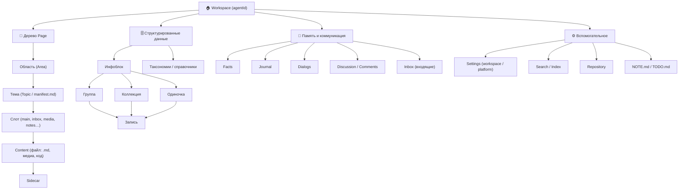

# AGENT CMS
**Agent CMS** — хранилище контекста и контента для LLM-агентов. Не «система для агентов», а **общий ящик**: заметки, документы, медиа, мысли и секреты — по одним правилам, на диске в markdown и YAML, без базы данных. Человек — веб или desktop, агент — MCP; один язык, одна структура, без перевода между вами и ИИ. **CMS** — Content Management System · **Context** Management System.

## Три приложения
| Название | Назначение |
|----------|------------|
| **Agent CMS** | Редактор: дерево workspace, темы и области, настройки, память, интеграции, MCP |
| **Agent CMS Voice** | Голос и диалог к тому же хранилищу — одна история на компьютере, телефоне и в браузере |
| **Agent CMS Control** | Пульт (ЦУП): сервер, сборки desktop, зависимости, ярлыки |
Один workspace — три входа. UI, MCP и голос — разные интерфейсы, одно хранилище.

## Зачем
Жизнь разбросана по кусочкам; обычный чат с ИИ — амнезия с чистого листа. Agent CMS — долгий совместный диалог: агент знает, **куда записать** и **где найти**, вы вместе наводите порядок. Источник правды — **диск**, не переписка. Со временем накапливается память: «фильмы — в Кино», «смета — в Стройке», связи между областями.

## Для кого
**Лично** — заметки, дела, обучение, здоровье, медиа в одном дереве; голосом записал — агент разложил по местам.
**Команда** — общая база знаний: области по проектам, единые правила для людей и ИИ, MCP для корпоративных агентов (роли, журнал, vault-слоты — по мере внедрения).

## Как устроено
**Workspace** — корень хранилища (`manifest.md`): ваш проект или изолированная область. Один агент — одно workspace; оркестратор может координировать несколько.
**Платформа** — `agent-cms-core`: типы, MCP-tools, справочники, `settings.global.yml`. Из коробки также `agent-cms-test` — песочница для экспериментов.
**Каркас дерева** — workspace → **область** (раздел меню) → **тема** (страница со слотами) → **запись** в слоте (`main`, `inbox`, `media`…). Структуру задаёте вы с агентом, не жёсткий шаблон.
**Инфоблоки (`awn-databases`)** — структурированные данные вне дерева: коллекции со `schema.yml`, `{id}.md`, таксономии («Накопители информации»). Одинаковые поля → инфоблок; свободный текст и навигация по теме → дерево.
**Sidecar** — `.sidecar.md` рядом с фото или PDF: описание, теги и связи, когда в сам файл текст не кладётся.
**Секреты** — `.env`. **Runtime** — `.agent-cms/` (индексы, кэш, UI).

## Принципы
1. **Общий язык** — одни правила для человека и агента.
2. **Файлы вместо БД** — контент на диске; индексы (смысл, слова, связи) пересобираются из файлов.
3. **Синергия 1+1** — вы ведёте порядок, агент помнит контекст и действует в хранилище.

## Стек
- **Node.js** — сервер, MCP, индексация, API
- **Файловое хранилище** — Markdown, YAML, JSON
- **SQLite** — семантический, полнотекстовый и link-индексы
- **MCP** — Cursor, Claude и другие агенты
- **Веб-UI** — vanilla JS, Toast UI Editor, Mermaid
- **Electron** — desktop: CMS, Voice, Control
- **Голос** — voice-server, TTS, 3D-shell (Three.js)
- **OCR и медиа** — Tesseract.js, Sharp; Office/PDF

## Первый старт
1. Клонируйте репозиторий, `npm install` (или сделает скрипт).
2. Запустите **`welcome.command`** — Agent CMS Control (macOS: двойной клик; `chmod +x welcome.command`).
3. В Control — старт сервера, CMS в браузере (https://localhost:3443).
4. Выберите workspace (`agent-cms-core` / `agent-cms-test` или свой), прочитайте `AGENTS.md`.
Этот README на главной CMS. В чат: *«объясни Agent CMS по README.md»*.

## Ссылки
- Сайт: https://agent-cms.ru/
- GitHub: https://github.com/iv-litovchenko/AgentCMS
