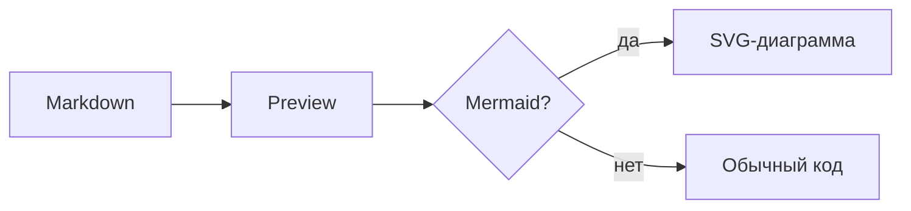
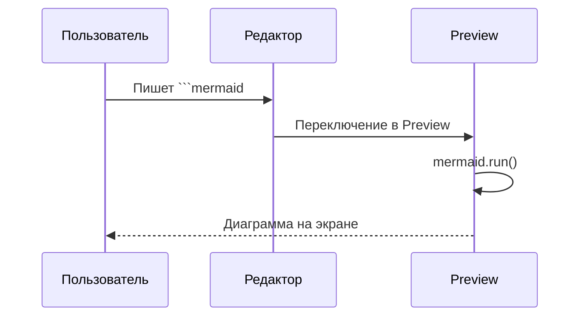
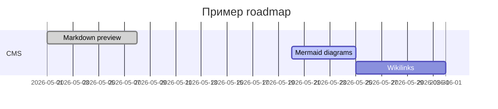

# Markdown Showcase

Справочник элементов для preview (markdown-it). Откройте через кнопку **MD** в шапке Agent CMS.

---

## Заголовки

# H1 — главный заголовок
## H2 — раздел
### H3 — подраздел
#### H4 — пункт
##### H5 — мелкий заголовок
###### H6 — самый мелкий

---

## Абзацы и переносы

Обычный абзац с **жирным**, *курсивом*, ***жирным курсивом*** и `inline code`.

В markdown-it включён `breaks: true` — перенос строки в исходнике
даёт `<br>` в preview (как здесь).

---

## Ссылки

- [Ссылка на Agent CMS](https://example.com)
- Автоссылка: https://github.com/markdown-it/markdown-it

---

## Списки

### Маркированный

- Пункт один
- Пункт два
  - Вложенный A
  - Вложенный B
- Пункт три

### Нумерованный

1. Первый
2. Второй
   1. Вложенный 2.1
   2. Вложенный 2.2
3. Третий

---

## Цитата (blockquote)

> Цитата первого уровня.
>
> > Вложенная цитата.
>
> Конец блока.

---

## Код

Inline: `const answer = 42;`

Блок кода:

```javascript
function greet(name) {
  return `Hello, ${name}!`;
}

console.log(greet("Agent CMS"));
```

```yaml
title: Пример YAML
tags:
  - demo
  - markdown
status: draft
```

---

## Горизонтальная линия

Текст выше линии.

---

Текст ниже линии.

---

## Изображение


### Локальные вложения (_Assets)

Вставьте изображение в редактор (Source или Edit) — файл сохранится в `_Storage/_Assets/` и появится ссылка:

```markdown

```

Preview автоматически подставит URL `/api/media/file?…`.

---

## GitHub Alerts

Официальные типы GitHub (blockquote + `[!TYPE]`). Регистр не важен.

> [!NOTE]
> Highlights information that users should take into account, even when skimming.

> [!TIP]
> Optional information to help a user be more successful.

> [!IMPORTANT]
> Crucial information necessary for users to succeed.

> [!WARNING]
> Critical content demanding immediate user attention due to potential risks.

> [!CAUTION]
> Negative potential consequences of an action.

Свой заголовок после типа:

> [!WARNING] Внимание
> Можно заменить стандартный заголовок Warning.

---

## Диаграммы (Mermaid)

Блоки с языком `mermaid` рендерятся в preview через [Mermaid](https://mermaid.js.org/) — как в Obsidian.

### Flowchart



### Sequence diagram



### Gantt



> Диаграммы работают в **Preview**, overview и навигации. В режиме **Edit** (WYSIWYG) блок остаётся текстом.

---

## Элементы без поддержки (пока)

Ниже — синтаксис, который **не рендерится** текущим markdown-it без плагинов / кастомных правил.

### Таблица (GFM) — нужен плагин

| Колонка A | Колонка B |
|-----------|-----------|
| alpha     | beta      |
| 1         | 2         |

### Зачёркивание — нужен плагин

~~Этот текст зачёркнут~~

### Чеклист — нужен плагин

- [ ] Не сделано
- [x] Сделано

### Obsidian wikilink — нужно своё правило

[[Другая нода]]
[[Путь/К ноде|Подпись]]

### HTML — отключён (`html: false`)

<div style="color:red">Красный HTML не пройдёт</div>

---

## Как добавить своё правило

В `public/main.js`, функция `getMarkdownIt()`:

```javascript
// Пример: [[wikilink]]
md.inline.ruler.before("link", "wikilink", (state, silent) => {
  // ... разбор токена ...
  return true;
});
md.renderer.rules.wikilink = (tokens, idx) => {
  const label = tokens[idx].content;
  return `<a class="wikilink" href="#">${label}</a>`;
};
```

Или подключить готовый плагин: `md.use(markdownItTaskLists)` и т.д.

---

*Конец showcase. Исходник: `public/_storage/markdown-showcase.md`.*
