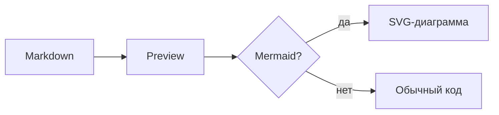
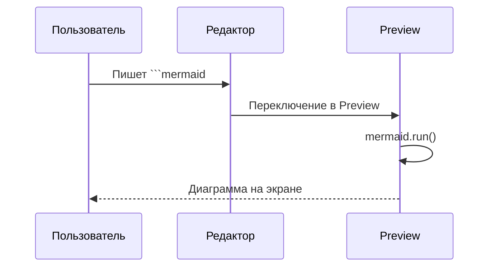
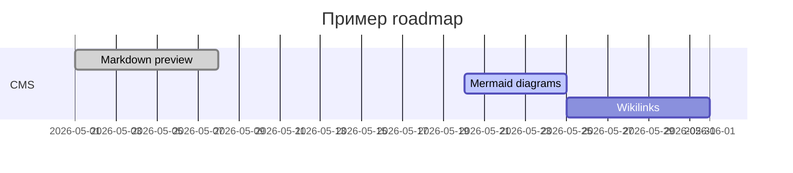

# Markdown Showcase

Справочник элементов для preview (markdown-it). Откройте через кнопку **MD** в шапке Agent CMS.

---

## Заголовки

# H1 — главный заголовок
## H2 — раздел
### H3 — подраздел
#### H4 — пункт
##### H5 — мелкий заголовок
###### H6 — самый мелкий

---

## Абзацы и переносы

Обычный абзац с **жирным**, *курсивом*, ***жирным курсивом*** и `inline code`.

В markdown-it включён `breaks: true` — перенос строки в исходнике
даёт `<br>` в preview (как здесь).

---

## Ссылки

- [Ссылка на Agent CMS](https://example.com)
- Автоссылка: https://github.com/markdown-it/markdown-it

---

## Списки

### Маркированный

- Пункт один
- Пункт два
  - Вложенный A
  - Вложенный B
- Пункт три

### Нумерованный

1. Первый
2. Второй
   1. Вложенный 2.1
   2. Вложенный 2.2
3. Третий

---

## Цитата (blockquote)

> Цитата первого уровня.
>
> > Вложенная цитата.
>
> Конец блока.

---

## Код

Inline: `const answer = 42;`

Блок кода:

```javascript
function greet(name) {
  return `Hello, ${name}!`;
}

console.log(greet("Agent CMS"));
```

```yaml
title: Пример YAML
tags:
  - demo
  - markdown
status: draft
```

---

## Горизонтальная линия

Текст выше линии.

---

Текст ниже линии.

---

## Изображение


### Локальные вложения (Assets/Pasted)

Вставьте изображение в редактор (Source или Edit) — файл сохранится в `_Storage/Assets/Pasted/` и появится ссылка:

```markdown

```

Preview автоматически подставит URL `/api/media/file?…`.

---

## Оформление картинок (7 вариантов)

Демо на одном изображении (по 3 копии в каждом примере). Откройте через кнопку **MD**.

<div class="preview-image-demo">
<p class="preview-image-demo-title">1. Карточка с ограничением</p>
<p class="preview-image-demo-note"><code>max-width: min(50%, 520px)</code>, <code>max-height: 360px</code>, <code>object-fit: contain</code> — скрин не раздувает блок, мелкая картинка не исчезает.</p>
<div class="img-style-card">


</div>
</div>

<div class="preview-image-demo">
<p class="preview-image-demo-title">2. Адаптивная ширина (clamp)</p>
<p class="preview-image-demo-note"><code>max-width: clamp(180px, 45vw, 520px)</code> — подстраивается под экран и размер картинки. <strong>Используется в обзоре темы.</strong></p>
<div class="img-style-clamp">


</div>
</div>

<div class="preview-image-demo">
<p class="preview-image-demo-title">3. Figure + подпись</p>
<p class="preview-image-demo-note">Обёртка <code>&lt;figure&gt;</code> + <code>&lt;figcaption&gt;</code> — удобно для вложений «Вложение 1, 2, 3…».</p>
<div class="img-style-figure">
<figure><figcaption>Вложение 1 · menu-bad-readability</figcaption></figure>
<figure><figcaption>Вложение 2 · keywords-main-page</figcaption></figure>
<figure><figcaption>Вложение 3 · tasks-medknizhki</figcaption></figure>
</div>
</div>

<div class="preview-image-demo">
<p class="preview-image-demo-title">4. Сетка (несколько скринов)</p>
<p class="preview-image-demo-note"><code>display: grid</code>, <code>object-fit: cover</code> — компактно, когда вложений несколько подряд.</p>
<div class="img-style-grid">


</div>
</div>

<div class="preview-image-demo">
<p class="preview-image-demo-title">5. Lightbox (клик → полный размер)</p>
<p class="preview-image-demo-note">В обзоре — миниатюра (<code>max-height: 280px</code>). Клик по картинке открывает оверлей.</p>
<div class="img-style-lightbox">


</div>
</div>

<div class="preview-image-demo">
<p class="preview-image-demo-title">6. Два режима: обзор vs редактор</p>
<p class="preview-image-demo-note">Слева — компактный обзор темы, справа — preview редактора на всю ширину.</p>
<div class="img-style-compare">
<div class="img-style-compare-col">
<p class="img-style-compare-label">Обзор</p>
<div class="img-style-overview">


</div>
</div>
<div class="img-style-compare-col">
<p class="img-style-compare-label">Редактор / Preview</p>
<div class="img-style-editor">


</div>
</div>
</div>
</div>

<div class="preview-image-demo">
<p class="preview-image-demo-title">7. Авто: широкие vs компактные</p>
<p class="preview-image-demo-note">JS смотрит <code>naturalWidth / naturalHeight</code>: если &gt; 1.4 — класс <code>is-wide</code> (70%), иначе <code>is-compact</code> (240px). Птица здесь — landscape, все три будут «wide».</p>
<div class="img-style-auto">


</div>
</div>

---

## GitHub Alerts

Официальные типы GitHub (blockquote + `[!TYPE]`). Регистр не важен.

> [!NOTE]
> Highlights information that users should take into account, even when skimming.

> [!TIP]
> Optional information to help a user be more successful.

> [!IMPORTANT]
> Crucial information necessary for users to succeed.

> [!WARNING]
> Critical content demanding immediate user attention due to potential risks.

> [!CAUTION]
> Negative potential consequences of an action.

Свой заголовок после типа:

> [!WARNING] Внимание
> Можно заменить стандартный заголовок Warning.

---

## Диаграммы (Mermaid)

Блоки с языком `mermaid` рендерятся в preview через [Mermaid](https://mermaid.js.org/) — как в Obsidian.

### Flowchart



### Sequence diagram



### Gantt



> Диаграммы работают в **Preview**, overview и навигации. В режиме **Edit** (WYSIWYG) блок остаётся текстом.

---

## Элементы без поддержки (пока)

Ниже — синтаксис, который **не рендерится** текущим markdown-it без плагинов / кастомных правил.

### Таблица (GFM) — нужен плагин

| Колонка A | Колонка B |
|-----------|-----------|
| alpha     | beta      |
| 1         | 2         |

### Зачёркивание — нужен плагин

~~Этот текст зачёркнут~~

### Чеклист — нужен плагин

- [ ] Не сделано
- [x] Сделано

### Obsidian wikilink — нужно своё правило

[[Другая нода]]
[[Путь/К ноде|Подпись]]

### HTML — включён (`html: true`)

<div style="color:red">Красный HTML</div>

---

## Как добавить своё правило

В `public/main.js`, функция `getMarkdownIt()`:

```javascript
// Пример: [[wikilink]]
md.inline.ruler.before("link", "wikilink", (state, silent) => {
  // ... разбор токена ...
  return true;
});
md.renderer.rules.wikilink = (tokens, idx) => {
  const label = tokens[idx].content;
  return `<a class="wikilink" href="#">${label}</a>`;
};
```

Или подключить готовый плагин: `md.use(markdownItTaskLists)` и т.д.

---

*Конец showcase. Исходник: `public/_storage/markdown-showcase.md`.*
