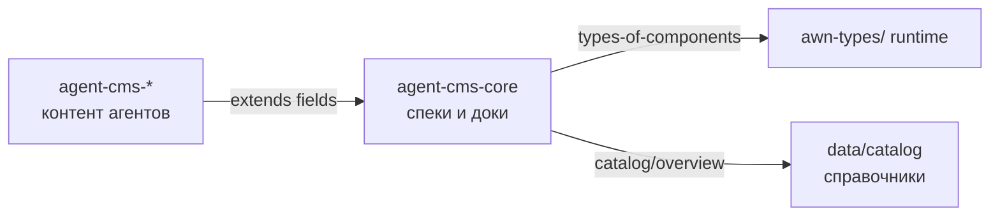

# Карта `agent-cms-core`

## 1. Области (areas)

### `documentations/` — для людей

| Топик | Назначение |
|-------|------------|
| `user-docs-0.0.1.md` | Руководство пользователя |
| `agent-best-practices.md` | Организация workspace агента |
| `markdown-showcase.md` | Пример preview |
| `components-ideas.md` | Черновик онтологии UI |
| `drafts/*.md` | Черновики (records) |

Кнопки в шапке UI: **DOC**, **BP**, **MD**, **💡** → этот агент, папка `documentations/`.

---

### `types-of-components/` — онтология

Что **бывает** в системе. Каждый тип = топик + schema в `awn-storage`.

```
types-of-components/
├── _base.md                    awn.component
├── awn-storage/_base/configuration/schema.yml
│
├── nodes/                      типы документов
│   ├── _base, workspace, areas, topic, record, comments
│   └── awn-storage/{slot}/configuration/schema.yml
├── fields/                     примитивы полей
├── blocks/                     блоки редактора
├── views/                      представления UI
├── mcp/                        дескрипторы MCP-tools (план)
└── skills/                     Agent Skills (план)
```

---

### `runtime/` — исполнение

Спека того, **как код** реализует правила. Топики — документация; код — в корне репо.

| Топик | Код |
|-------|-----|
| [manifest-paths.md](runtime/manifest-paths.md) | `manifest-paths.js` |
| [loaders.md](runtime/loaders.md) | `awn-types-loader.js`, `awn-fields-loader.js`, `awn-blocks-loader.js` |
| [server-api.md](runtime/server-api.md) | `server.js`, `docs/api-*.js` |

**Цель:** loader читает `**/configuration/schema.yml` из `types-of-components/`, а не дублирует `awn-types/`.

---

### `integrations/` — внешний мир

| Топик | Код / артеfact |
|-------|----------------|
| [mcp-server.md](integrations/mcp-server.md) | `mcp-server/` |
| [hooks.md](integrations/hooks.md) | Cursor hooks (план) |

Отличие от `types-of-components/mcp/`: там **схемы tool-компонентов**, здесь **деploy и wiring**.

---

### `catalog/` — глобальные справочники

Не дублирует данные. Указывает на workspace **`data/catalog/`**:

- tags, categories, statuses, users, priorities, colors, schemas
- данные: `catalog/awn-storage/{topic}/content.csv`

---

## 2. Корневые топики

| Файл | Смысл |
|------|--------|
| **platform-map.md** | этот документ |
| **agent-groups.md** | слои storage: content, inbox, thread, media… |
| **ideasmd.md** | backlog: Inbox, Диалог, Комментарии |

---

## 3. Три workspace платформы



---

## 4. Статус наполнения

| Область | Статус |
|---------|--------|
| documentations | ✅ живые доки |
| types-of-components | 🟡 nodes/fields/blocks частично |
| runtime | 🟡 скелет топиков |
| integrations | 🟡 скелет |
| catalog | 🟡 ссылка на data/catalog |
| agent-groups, ideasmd | ✅ черновики есть |
