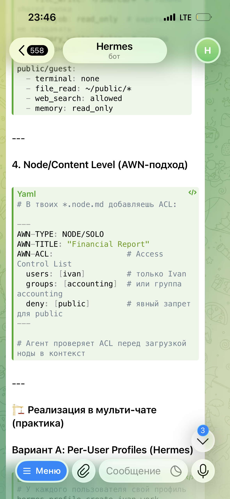

1. Загрузка больших объемов файлов типа слайдера в `медцентре`
2. Слот шаред для гугл диска
3.  Проверить всю цепочку свойство
4. Настройки (базовые)
5. Agent Downloads (как подхватыть папку) - другой тип темы awn.page.repo?


**Корзина**
awn-recycle-path-origin
awn-recycle-date

пароли

- Тест схемы и конфигурации**
- Тест всех полей
- Тест ссылок 
- Тест картинок
- Тест файлов
- Полный тест СОздание агента области темы раздела записей

agent-cms-test у нас ничего нет жестко заточенного на этого агента
если я удалить его решу ничего не сломается?

5. scripts/ — «точки входа»
Что это: Python-скрипты, которые запускают конкретные операции. Это код, который агент написал и может переиспользовать.

```
awn-system (ядро платформы)
│  configuration-schema.yml · awn-*
│  Базовые поля типов: awn-type, awn-name, awn-title…
│  Не редактируются в workspace
│
└── workspace (корень агента)
    │  manifest.md · awn.page.ws
    │  configuration-schema.yml · layer: workspace · ws-*
    │  Редактор: «Схема полей workspace»
    │
    └── область (area)
        │  manifest.md · awn.page.area
        │  configuration-schema.yml · layer: area · area-*
        │  Редактор: «Схема полей области»  ← разблокировано
        │  Эффективная схема = ядро + ws + area
        │
        └── тема (topic)
            │  manifest.md · awn.topic
            │  configuration-schema.yml · layer: topic · field_*
            │  + слоты: slot_memory, slot_media, sidecar, settings…
            │  Эффективная схема = ядро + ws + area + topic
            │
            └── раздел (section)
                │  config.yml раздела
                │  slot_* targets в схеме темы
                └─ Эффективная схема = всё выше + поля раздела/слота
```

```
npm run start:https

cd ~/Desktop/YamlCMS  Запустите CMS...

HOST=0.0.0.0 npm start

ipconfig getifaddr end
http://192.168.0.102:3000/shell/mobile/index.html
```

