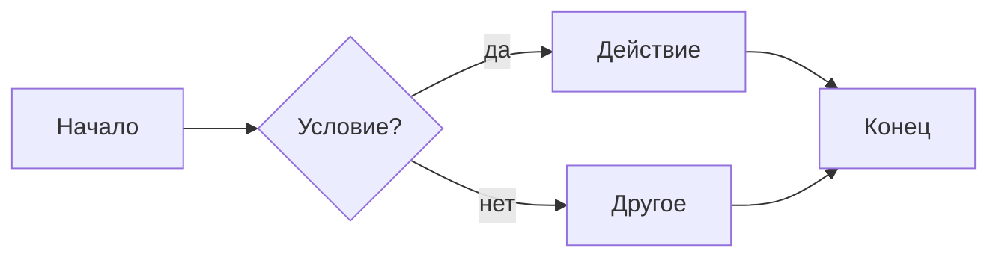
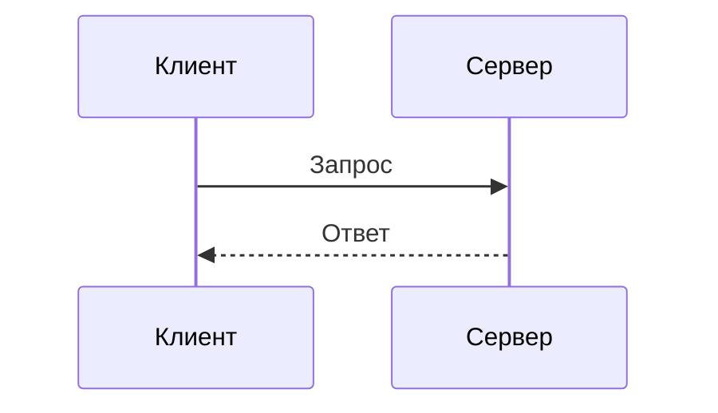
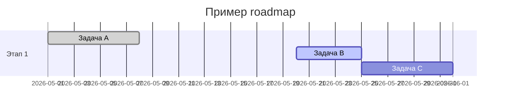
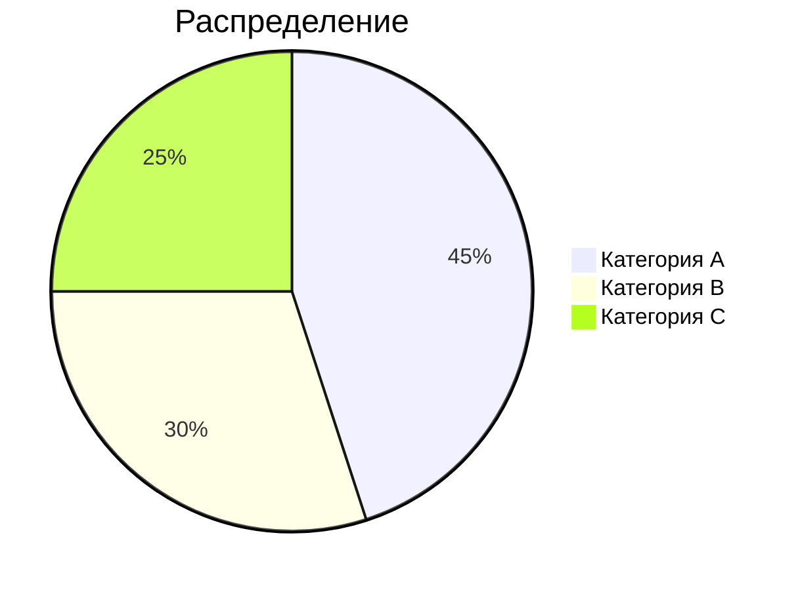
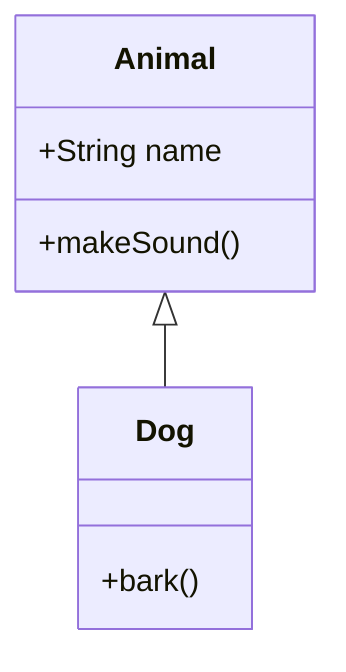
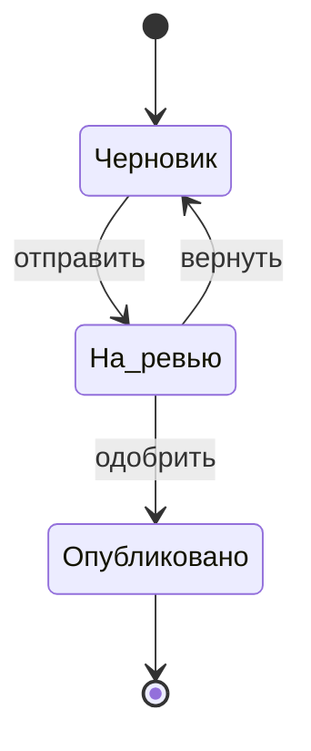
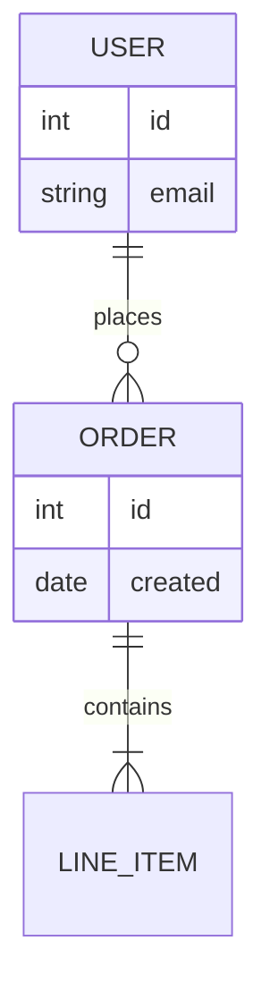
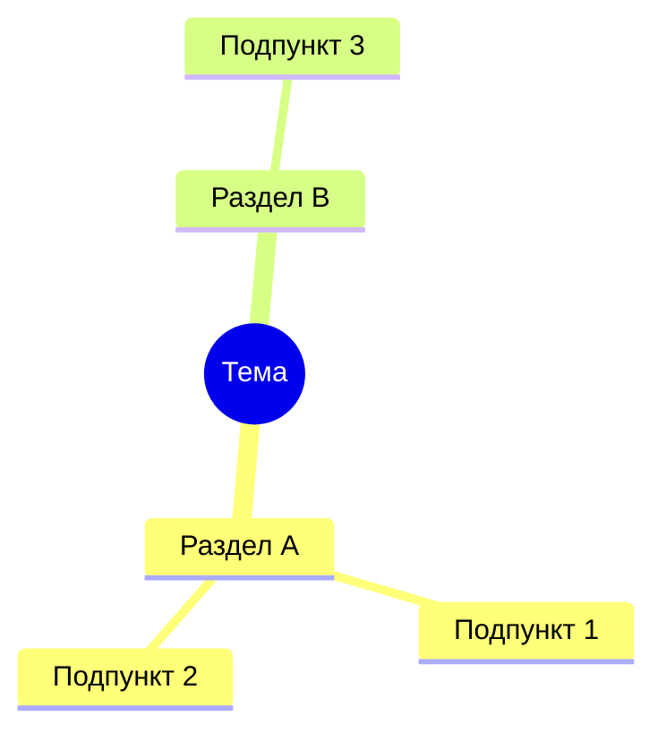

```mermaid
flowchart LR
  A[Начало] --> B{Условие?}
  B -->|да| C[Действие]
  B -->|нет| D[Другое]
  C --> E[Конец]
  D --> E
```

```mermaid
sequenceDiagram
  participant A as Клиент
  participant B as Сервер
  A->>B: Запрос
  B-->>A: Ответ
```

```mermaid
gantt
  title Пример roadmap
  dateFormat YYYY-MM-DD
  section Этап 1
  Задача A     :done, a1, 2026-05-01, 7d
  Задача B     :active, a2, 2026-05-20, 5d
  Задача C     :a3, after a2, 7d
```

```mermaid
pie title Распределение
  "Категория A" : 45
  "Категория B" : 30
  "Категория C" : 25
```

```mermaid
classDiagram
  class Animal {
    +String name
    +makeSound()
  }
  class Dog {
    +bark()
  }
  Animal <|-- Dog
```

```mermaid
stateDiagram-v2
  [*] --> Черновик
  Черновик --> На_ревью : отправить
  На_ревью --> Опубликовано : одобрить
  На_ревью --> Черновик : вернуть
  Опубликовано --> [*]
```

```mermaid
erDiagram
  USER ||--o{ ORDER : places
  ORDER ||--|{ LINE_ITEM : contains
  USER {
    int id
    string email
  }
  ORDER {
    int id
    date created
  }
```

```mermaid
mindmap
  root((Тема))
    Раздел A
      Подпункт 1
      Подпункт 2
    Раздел B
      Подпункт 3
```

