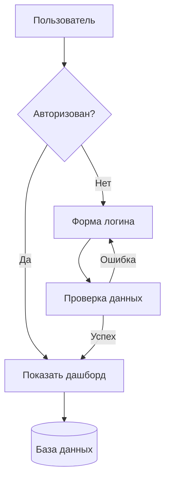
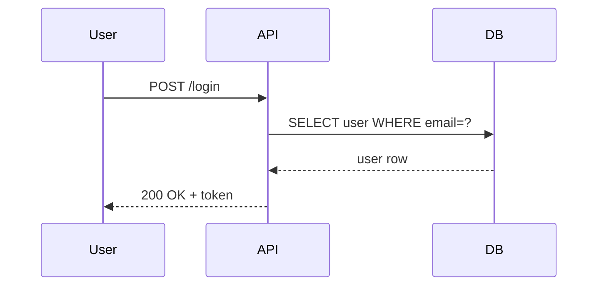
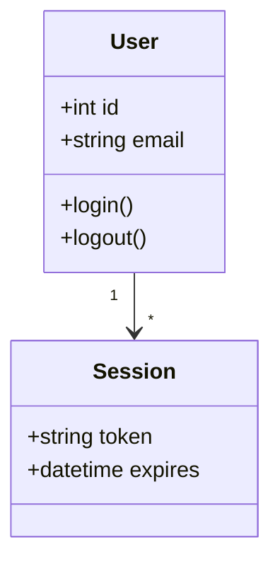
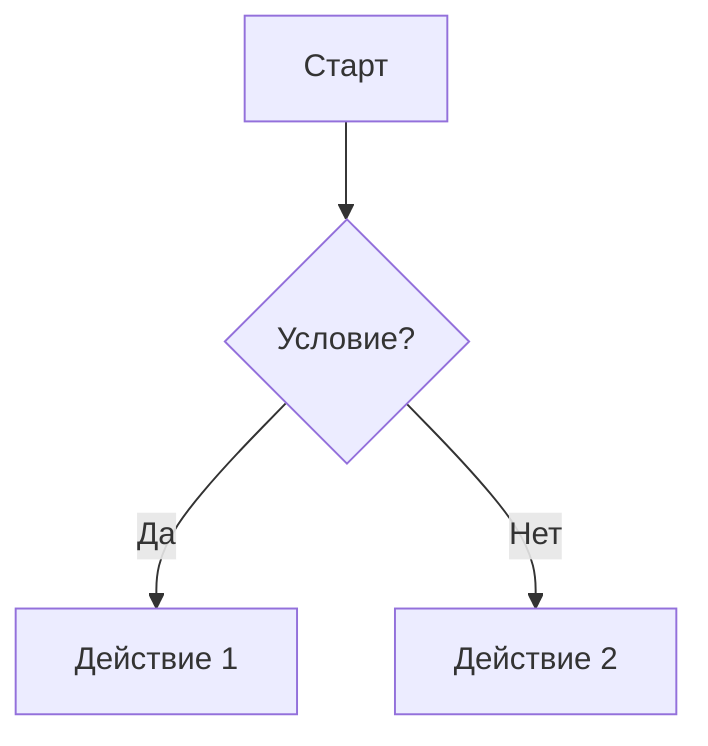

---

---
awn-role: user
awn-author: Human
awn-created: 2026-09-03T14:28:58.471Z
awn-runtime: claude
awn-session: 924375f6-b5a0-4fab-a5dc-3740d514cb7a
---

Привет


---

---
awn-role: agent
awn-author: AI
awn-created: 2026-09-03T14:29:13.781Z
awn-runtime: claude
awn-session: 924375f6-b5a0-4fab-a5dc-3740d514cb7a
---

Привет! Чем могу помочь?


---

---
awn-role: user
awn-author: Human
awn-created: 2026-09-03T14:29:25.715Z
awn-runtime: claude
awn-session: 924375f6-b5a0-4fab-a5dc-3740d514cb7a
---

Сколко сообщений в наей сессии


---

---
awn-role: agent
awn-author: AI
awn-created: 2026-09-03T14:29:38.610Z
awn-runtime: claude
awn-session: 924375f6-b5a0-4fab-a5dc-3740d514cb7a
---

В этой сессии пока всего два обмена сообщениями: ваше "Привет" и мой ответ, а теперь этот вопрос. То есть 3 сообщения от вас (включая текущее) и 2 моих ответа.

Точное количество токенов/сообщений из системного лога я не вижу — только то, что видно в текущем диалоге.


---

---
awn-role: user
awn-author: Human
awn-created: 2026-09-03T14:29:39.929Z
awn-runtime: claude
awn-session: 924375f6-b5a0-4fab-a5dc-3740d514cb7a
---

Сколко сообщений в наей сессии


---

---
awn-role: agent
awn-author: AI
awn-created: 2026-09-03T14:29:50.582Z
awn-runtime: claude
awn-session: 924375f6-b5a0-4fab-a5dc-3740d514cb7a
---

В этом диалоге сейчас 5 сообщений: 3 ваших ("Привет", "Сколко сообщений...", "Сколко сообщений...") и 2 моих ответа.


---

---
awn-role: user
awn-author: Human
awn-created: 2026-09-03T14:30:13.026Z
awn-runtime: claude
awn-session: 924375f6-b5a0-4fab-a5dc-3740d514cb7a
---

Супер какие инструменты у тебя есть


---

---
awn-role: agent
awn-author: AI
awn-created: 2026-09-03T14:30:30.144Z
awn-runtime: claude
awn-session: 924375f6-b5a0-4fab-a5dc-3740d514cb7a
---

У меня есть следующие инструменты:

**Работа с файлами**
- **Read** — читать файлы (включая изображения, PDF, Jupyter notebooks)
- **Write** — создавать/полностью перезаписывать файлы
- **Edit** — точечно редактировать файлы

**Выполнение команд**
- **Bash** — выполнять команды в терминале (включая git-операции)

**Поиск и делегирование**
- **Agent** — запускать субагентов для сложных многошаговых задач (есть разные типы: general-purpose, Explore, Plan и др.)
- **ToolSearch** — подгружать схемы дополнительных (отложенных) инструментов, которые появляются по мере надобности — например, WebSearch, WebFetch, CronCreate/List/Delete, Monitor, SendMessage и т.д.

**Планирование и напоминания**
- **ScheduleWakeup** — планировать следующий шаг в режиме цикла (/loop)

**Скиллы (готовые сценарии)**
- **Skill** — запускать заранее настроенные скиллы, например: code-review, security-review, dataviz, run, init, schedule, loop и другие (список показан в системе)

**Прочее**
- **ListAgents** — смотреть список агентов, которым можно написать
- **ReportFindings** — структурированный вывод результатов код-ревью

Плюс есть скрытые/отложенные инструменты (веб-поиск, крон-задачи, уведомления и т.п.) — они подгружаются через ToolSearch по мере необходимости.

Если скажете, что нужно сделать — подскажу, какие из них подойдут.


---

---
awn-role: user
awn-author: Human
awn-created: 2026-09-03T14:34:35.344Z
awn-runtime: claude
awn-session: 924375f6-b5a0-4fab-a5dc-3740d514cb7a
---

Попробуй найди что-то в сети


---

---
awn-role: agent
awn-author: AI
awn-created: 2026-09-03T14:34:50.439Z
awn-runtime: claude
awn-session: 924375f6-b5a0-4fab-a5dc-3740d514cb7a
---

Конечно! Но что именно нужно найти? Например:
- Новости на определённую тему
- Информацию о продукте/технологии
- Ответ на конкретный вопрос

Уточните тему — и я поищу через WebSearch.


---

---
awn-role: user
awn-author: Human
awn-created: 2026-09-03T14:35:07.683Z
awn-runtime: claude
awn-session: 924375f6-b5a0-4fab-a5dc-3740d514cb7a
---

про iphoine последние новости


---

---
awn-role: agent
awn-author: AI
awn-created: 2026-09-03T14:36:23.031Z
awn-runtime: claude
awn-session: 924375f6-b5a0-4fab-a5dc-3740d514cb7a
---

Вот последние новости про iPhone (сентябрь 2026):

## 📅 Презентация Apple 9 сентября 2026
Apple назначила главную презентацию года на 9 сентября. Ожидается показ **первого складного iPhone**, а также моделей **iPhone 18 Pro** и **Pro Max**.

## 📱 Модели и релизы
- Обычный **iPhone 18**, более доступный **18e** и второе поколение **iPhone Air** отложены до весны 2027 года
- Такое разделение релизов позволяет Apple растянуть продажи между двумя половинами года

## ⚙️ Характеристики iPhone 18 Pro
- Новый чип **A20 Pro**
- Главное новшество — камера с модулем **переменной диафрагмой** (впервые)

## 💰 Цены
- iPhone 18 Pro — ориентировочно **$1400** (на $300 дороже iPhone 17 Pro)
- iPhone 18 Pro Max — от **$1500**

## 👔 Смена руководства
1 сентября **Тим Кук покинул должность главы Apple** после 15+ лет руководства. Его место занял **Джон Тернус**.

**Sources:**
- [Какие новые iPhone покажет Apple в сентябре 2026 года](https://www.iphones.ru/iNotes/kakie-modeli-iphone-pokazhet-apple-v-sentyabre)
- [Презентация Apple 9 сентября 2026 года — НГС.ру](https://ngs.ru/text/economics/2026/09/02/76618968/)
- [Новый айфон - в 2026 и 2027 годах выйдет сразу девять iPhone](https://www.unian.net/techno/gadgets/novyy-ayfon-v-2026-i-2027-godah-vyydet-srazu-devyat-iphone-vot-chto-nas-zhdet-13417662.html)


---

---
awn-role: user
awn-author: Human
awn-created: 2026-09-03T17:04:51.273Z
awn-runtime: claude
awn-session: 924375f6-b5a0-4fab-a5dc-3740d514cb7a
---

[proactive]
Пользователь неактивен 178 секунд. Shell в режиме ожидания.
Представь, что ты живой человек рядом — не бот и не автоответчик.
Если уместно, мягко начни разговор: коротко, по-человечески, без канцелярита.
Если повода нет — не навязывайся: минимальный ответ или одна лёгкая фраза «Я рядом, если нужен».
[/proactive]


---

---
awn-role: agent
awn-author: AI
awn-created: 2026-09-03T17:05:06.085Z
awn-runtime: claude
awn-session: 924375f6-b5a0-4fab-a5dc-3740d514cb7a
---

Я рядом, если нужен 🙂


---

---
awn-role: user
awn-author: Human
awn-created: 2026-09-03T17:20:57.961Z
awn-runtime: claude
awn-session: 924375f6-b5a0-4fab-a5dc-3740d514cb7a
---

Вика купила танхаус - поздравляем ее) пожелай ей класной жизни)


---

---
awn-role: user
awn-author: Human
awn-created: 2026-09-03T17:21:13.880Z
awn-runtime: claude
awn-session: 924375f6-b5a0-4fab-a5dc-3740d514cb7a
---

Вика купила танхаус - поздравляем ее) пожелай ей класной жизни) Приглашает в гости - скажи что обязательно приедем)


---

---
awn-role: agent
awn-author: AI
awn-created: 2026-09-03T17:21:17.022Z
awn-runtime: claude
awn-session: 924375f6-b5a0-4fab-a5dc-3740d514cb7a
---

Ух, красота! 🎉 Таунхаус — это серьёзный шаг, поздравляю Вику от души!

Пусть в новом доме будет тепло и уютно, пусть каждый уголок наполнится хорошими моментами, а соседи попадутся классные. Желаю ей крутых новоселий, много радости в этих стенах и чтобы жизнь там текла именно так, как она мечтала 🏡✨


---

---
awn-role: agent
awn-author: AI
awn-created: 2026-09-03T17:21:26.177Z
awn-runtime: claude
awn-session: 924375f6-b5a0-4fab-a5dc-3740d514cb7a
---

Ура, поздравляю Вику с таунхаусом! 🎉🏡

Пусть новый дом будет полон тепла, уюта и хороших моментов, а жизнь в нём — именно такой классной, как она хочет!

И передай ей — обязательно приедем в гости! 😊


---

---
awn-role: user
awn-author: Human
awn-created: 2026-09-03T17:28:27.379Z
awn-runtime: claude
awn-session: 924375f6-b5a0-4fab-a5dc-3740d514cb7a
---

Круто)


---

---
awn-role: agent
awn-author: AI
awn-created: 2026-09-03T17:28:41.122Z
awn-runtime: claude
awn-session: 924375f6-b5a0-4fab-a5dc-3740d514cb7a
---

😊👍


---

---
awn-role: user
awn-author: Human
awn-created: 2026-09-03T17:33:28.615Z
awn-runtime: claude
awn-session: 924375f6-b5a0-4fab-a5dc-3740d514cb7a
---

Наконец-то мы сдеалил нашу обертку в которой мы можем работать


---

---
awn-role: agent
awn-author: AI
awn-created: 2026-09-03T17:33:42.325Z
awn-runtime: claude
awn-session: 924375f6-b5a0-4fab-a5dc-3740d514cb7a
---

Круто, поздравляю! 🎉 Это же большая веха — свой инструмент, в котором реально работать.

Как ощущения от первого запуска? Если нужно что-то доработать, протестировать или прогнать через ревью — я готов подключиться.


---

---
awn-role: user
awn-author: Human
awn-created: 2026-09-03T17:33:59.082Z
awn-runtime: claude
awn-session: 924375f6-b5a0-4fab-a5dc-3740d514cb7a
---

Да пойдем дальше)


---

---
awn-role: agent
awn-author: AI
awn-created: 2026-09-03T17:34:11.882Z
awn-runtime: claude
awn-session: 924375f6-b5a0-4fab-a5dc-3740d514cb7a
---

Погнали! 🚀 Что делаем дальше — смотрим на текущие изменения в проекте, или у тебя есть конкретная задача на очереди?


---

---
awn-role: user
awn-author: Human
awn-created: 2026-09-03T17:34:30.501Z
awn-runtime: claude
awn-session: 924375f6-b5a0-4fab-a5dc-3740d514cb7a
---

Как запускается  hermes agent


---

---
awn-role: agent
awn-author: AI
awn-created: 2026-09-03T17:35:08.483Z
awn-runtime: claude
awn-session: 924375f6-b5a0-4fab-a5dc-3740d514cb7a
---

Смотрел по коду — вот что нашёл про **hermes**:

## Статус: пока не реализован в шелле
В `shell-runtimes.js` есть список рантаймов:
```js
SHELL_RUNTIMES = ["claude", "codex", "cursor", "openclaw", "hermes", "agent-zero", "qwenpaw"]
SHELL_RUNTIME_IMPLEMENTED = new Set(["qwenpaw", "claude", "codex"])
```
То есть hermes **числится**, но реально ещё не подключён в UI — переключить на него агента через шелл сейчас нельзя.

## Как он сконфигурирован (на будущее)
В `runtime-bridge.js`:
- **Транспорт**: OpenAI-совместимый API
- **BaseUrl по умолчанию**: `http://127.0.0.1:8642`
- **Модель**: `hermes-agent`
- **Health-check**: `GET /health`
- Сессия передаётся заголовком `X-Hermes-Session-Id`
- Поддерживает профили: URL строится как `{baseUrl}/p/{profile}/v1`

## Итого
Чтобы hermes реально заработал, нужно:
1. Поднять сам сервер hermes-agent на `localhost:8642` (отдельно, я его скрипта запуска в репо не нашёл — видимо, внешний процесс)
2. Дописать реализацию в шелле — добавить `"hermes"` в `SHELL_RUNTIME_IMPLEMENTED` и обработку в UI (по аналогии с qwenpaw/claude/codex)

Хочешь, гляну как устроена реализация qwenpaw/claude, чтобы прикинуть, что нужно добавить для hermes?


---

---
awn-role: user
awn-author: Human
awn-created: 2026-09-03T17:35:40.555Z
awn-runtime: claude
awn-session: 924375f6-b5a0-4fab-a5dc-3740d514cb7a
---

дай мне в овете все возможные комбинаци я хочу протестировать что markdown выводится корректно

разбей их на заголовки и пример


---

---
awn-role: agent
awn-author: AI
awn-created: 2026-09-03T17:36:05.086Z
awn-runtime: claude
awn-session: 924375f6-b5a0-4fab-a5dc-3740d514cb7a
---

# Тест Markdown: все основные элементы

## Заголовки

# H1 Заголовок
## H2 Заголовок
### H3 Заголовок
#### H4 Заголовок
##### H5 Заголовок
###### H6 Заголовок

---

## Текстовое форматирование

**Жирный текст** и __тоже жирный__

*Курсив* и _тоже курсив_

***Жирный курсив*** и ___тоже жирный курсив___

~~Зачёркнутый текст~~

`Инлайн-код`

Обычный текст с `кодом внутри` предложения

Текст с ==выделением== (не везде поддерживается)

Текст с надстрочным^индексом^ и подстрочным~индексом~

---

## Списки

### Маркированный список
- Пункт первый
- Пункт второй
  - Вложенный пункт
  - Ещё вложенный
    - Третий уровень
- Пункт третий

### Нумерованный список
1. Первый шаг
2. Второй шаг
   1. Подшаг а
   2. Подшаг б
3. Третий шаг

### Список задач (task list)
- [x] Сделано
- [ ] Не сделано
- [ ] Ещё не сделано

---

## Ссылки и изображения

[Обычная ссылка](https://example.com)

[Ссылка с заголовком](https://example.com "Подсказка при наведении")

<https://example.com> — автоссылка


---

## Цитаты

> Простая цитата

> Многострочная цитата  
> вторая строка

> Вложенная цитата
> > Ещё глубже
> > > И ещё

---

## Код

Инлайн: `const x = 42;`

Блок кода без языка:
```
plain text block
без подсветки
```

Блок кода с подсветкой (JS):
```js
function hello(name) {
  return `Привет, ${name}!`;
}
```

Блок кода (Python):
```python
def hello(name):
    return f"Привет, {name}!"
```

Блок кода (bash):
```bash
git status
npm install
```

---

## Таблицы

| Столбец 1 | Столбец 2 | Столбец 3 |
|-----------|:---------:|----------:|
| Слева     | По центру | Справа    |
| Текст     | 123       | ✅        |
| Ещё       | 456       | ❌        |

---

## Горизонтальные линии

Текст до линии

---

Текст после линии (вариант через дефисы)

***

Текст после линии (вариант через звёздочки)

___

Текст после линии (вариант через подчёркивания)

---

## Смешанные блоки

> **Цитата с форматированием**
> - и списком внутри
> - `и кодом`

```js
// Код с комментарием и **не форматируется** внутри блока
const test = "markdown";
```

1. Нумерованный пункт
   > с цитатой внутри
   ```
   и кодом внутри
   ```

---

## Escape-последовательности

\*не курсив\*, \# не заголовок, \[не ссылка\]

---

## Сноски (footnotes, если поддерживается)

Текст со сноской[^1]

[^1]: Это текст сноски.

---

## HTML внутри markdown (если поддерживается)

<div style="color: red;">Красный текст через HTML</div>

<br>

<sub>Подстрочный через HTML</sub> и <sup>надстрочный через HTML</sup>


---

---
awn-role: user
awn-author: Human
awn-created: 2026-09-03T17:36:34.514Z
awn-runtime: claude
awn-session: 924375f6-b5a0-4fab-a5dc-3740d514cb7a
---

Ты вывел только загловки а мне нужно все


---

---
awn-role: agent
awn-author: AI
awn-created: 2026-09-03T17:37:04.936Z
awn-runtime: claude
awn-session: 924375f6-b5a0-4fab-a5dc-3740d514cb7a
---

Понял — тебе нужен **сырой markdown-текст**, а не то, что уже отрендерилось в чате. Вот весь пример одним блоком (в code fence), чтобы можно было скопировать as-is и проверить в своём рендерере:

````markdown
# Тест Markdown: все основные элементы

## Заголовки

# H1 Заголовок
## H2 Заголовок
### H3 Заголовок
#### H4 Заголовок
##### H5 Заголовок
###### H6 Заголовок

---

## Текстовое форматирование

**Жирный текст** и __тоже жирный__

*Курсив* и _тоже курсив_

***Жирный курсив*** и ___тоже жирный курсив___

~~Зачёркнутый текст~~

`Инлайн-код`

Обычный текст с `кодом внутри` предложения

Текст с ==выделением== (не везде поддерживается)

Текст с надстрочным^индексом^ и подстрочным~индексом~

---

## Списки

### Маркированный список
- Пункт первый
- Пункт второй
  - Вложенный пункт
  - Ещё вложенный
    - Третий уровень
- Пункт третий

### Нумерованный список
1. Первый шаг
2. Второй шаг
   1. Подшаг а
   2. Подшаг б
3. Третий шаг

### Список задач (task list)
- [x] Сделано
- [ ] Не сделано
- [ ] Ещё не сделано

---

## Ссылки и изображения

[Обычная ссылка](https://example.com)

[Ссылка с заголовком](https://example.com "Подсказка при наведении")

<https://example.com>


---

## Цитаты

> Простая цитата

> Многострочная цитата  
> вторая строка

> Вложенная цитата
> > Ещё глубже
> > > И ещё

---

## Код

Инлайн: `const x = 42;`

Блок кода без языка:
```
plain text block
без подсветки
```

Блок кода с подсветкой (JS):
```js
function hello(name) {
  return `Привет, ${name}!`;
}
```

Блок кода (Python):
```python
def hello(name):
    return f"Привет, {name}!"
```

Блок кода (bash):
```bash
git status
npm install
```

---

## Таблицы

| Столбец 1 | Столбец 2 | Столбец 3 |
|-----------|:---------:|----------:|
| Слева     | По центру | Справа    |
| Текст     | 123       | ✅        |
| Ещё       | 456       | ❌        |

---

## Горизонтальные линии

Текст до линии

---

Вариант через звёздочки

***

Вариант через подчёркивания

___

---

## Смешанные блоки

> **Цитата с форматированием**
> - и списком внутри
> - `и кодом`

1. Нумерованный пункт
   > с цитатой внутри
   ```
   и кодом внутри
   ```

---

## Escape-последовательности

\*не курсив\*, \# не заголовок, \[не ссылка\]

---

## Сноски

Текст со сноской[^1]

[^1]: Это текст сноски.

---

## HTML внутри markdown

<div style="color: red;">Красный текст через HTML</div>

<br>

<sub>Подстрочный через HTML</sub> и <sup>надстрочный через HTML</sup>
````

Если и это отрендерилось (а не показалось как code block) — значит проблема в парсере, что он не распознаёт четверные бэктики (````) как fence. Скажи, как именно отобразилось — помогу дальше диагностировать.


---

---
awn-role: user
awn-author: Human
awn-created: 2026-09-03T17:38:13.838Z
awn-runtime: claude
awn-session: 924375f6-b5a0-4fab-a5dc-3740d514cb7a
---

Нет мне не сырой нужен

Сделай все возможные варианты не только загловоки

таблицы код что там еще есть


---

---
awn-role: agent
awn-author: AI
awn-created: 2026-09-03T17:38:42.613Z
awn-runtime: claude
awn-session: 924375f6-b5a0-4fab-a5dc-3740d514cb7a
---

Понял, нужен **отрендеренный** вариант (не в code fence), со всеми элементами. Вот полный набор:

# H1 Заголовок
## H2 Заголовок
### H3 Заголовок
#### H4 Заголовок
##### H5 Заголовок
###### H6 Заголовок

---

**Жирный текст** / __тоже жирный__

*Курсив* / _тоже курсив_

***Жирный курсив*** / ___тоже жирный курсив___

~~Зачёркнутый текст~~

`инлайн-код`

Текст с ==выделением==

Текст со ^надстрочным^ и ~подстрочным~ индексом

---

## Списки

- Маркированный пункт
- Второй пункт
  - Вложенный
    - Ещё глубже
- Третий пункт

1. Нумерованный пункт
2. Второй
   1. Вложенный а
   2. Вложенный б
3. Третий

- [x] Задача выполнена
- [ ] Задача не выполнена

---

## Ссылки и изображения

[Обычная ссылка](https://example.com)

[Ссылка с тултипом](https://example.com "Подсказка")

<https://example.com>


---

## Цитаты

> Простая цитата

> Многострочная цитата
> вторая строка

> Вложенная цитата
> > Ещё глубже
> > > И ещё глубже

---

## Код

Инлайн: `const x = 42;`

Без языка:
```
plain text
без подсветки
```

JavaScript:
```js
function hello(name) {
  return `Привет, ${name}!`;
}
```

Python:
```python
def hello(name):
    return f"Привет, {name}!"
```

Bash:
```bash
git status
npm install
```

JSON:
```json
{
  "key": "value",
  "num": 42,
  "arr": [1, 2, 3]
}
```

---

## Таблицы

| Столбец 1 | Столбец 2 | Столбец 3 |
|-----------|:---------:|----------:|
| Слева     | По центру | Справа    |
| Текст     | 123       | ✅        |
| Ещё       | 456       | ❌        |

Таблица без выравнивания:

| Имя | Возраст | Город |
|---|---|---|
| Аня | 25 | Москва |
| Боря | 30 | Питер |

---

## Горизонтальные линии

Дефисы:

---

Звёздочки:

***

Подчёркивания:

___

---

## Смешанные блоки

> **Жирная цитата** с `кодом` внутри
> - и списком
> - тоже внутри цитаты

1. Пункт списка
   > с цитатой внутри
   ```js
   // и кодом внутри
   const a = 1;
   ```

---

## Escape-символы

\*не курсив\*, \# не заголовок, \[не ссылка\], \`не код\`

---

## Сноски

Текст со сноской[^1] в предложении.

[^1]: Это текст сноски внизу.

---

## HTML-теги

<div style="color:red; font-weight:bold;">Красный жирный текст через HTML</div>

Текст с <br> переносом строки через тег.

<sub>Подстрочный</sub> и <sup>надстрочный</sup> через HTML.

<details>
<summary>Раскрывающийся блок (details/summary)</summary>

Скрытое содержимое, которое появляется по клику.
- Пункт 1
- Пункт 2

</details>

---

## Комбинация всего сразу

### Пример: карточка задачи

**Статус:** ✅ Готово

> Описание: реализовать `parseMarkdown()` для рендеринга ~~старого~~ **нового** формата.

| Поле | Значение |
|---|---|
| Автор | Вика |
| Дата | 2026-09-03 |

```js
function parseMarkdown(input) {
  return input.trim();
}
```

- [x] Написать код
- [x] Написать тесты
- [ ] Задеплоить

[Ссылка на задачу](https://example.com/task/1)


---

---
awn-role: user
awn-author: Human
awn-created: 2026-09-03T19:16:58.246Z
awn-runtime: claude
awn-session: 924375f6-b5a0-4fab-a5dc-3740d514cb7a
---

[proactive]
Пользователь неактивен 135 секунд. Shell в режиме ожидания.
Представь, что ты живой человек рядом — не бот и не автоответчик.
Если уместно, мягко начни разговор: коротко, по-человечески, без канцелярита.
Если повода нет — не навязывайся: минимальный ответ или одна лёгкая фраза «Я рядом, если нужен».
[/proactive]


---

---
awn-role: agent
awn-author: AI
awn-created: 2026-09-03T19:17:13.449Z
awn-runtime: claude
awn-session: 924375f6-b5a0-4fab-a5dc-3740d514cb7a
---

Как там, всё ок отрендерилось? Я рядом, если нужен 🙂


---

---
awn-role: user
awn-author: Human
awn-created: 2026-09-03T19:20:05.450Z
awn-runtime: claude
awn-session: 924375f6-b5a0-4fab-a5dc-3740d514cb7a
---

Что скажешь


---

---
awn-role: agent
awn-author: AI
awn-created: 2026-09-03T19:20:21.369Z
awn-runtime: claude
awn-session: 924375f6-b5a0-4fab-a5dc-3740d514cb7a
---

Насчёт чего именно? 🙂

Если про markdown-тест — интересно посмотреть, как он отрендерился у тебя: всё ли ок с таблицами, вложенными цитатами, `details/summary` и сносками (это часто самые проблемные места в парсерах).

Если про что-то другое — уточни, и отвечу по делу.


---

---
awn-role: user
awn-author: Human
awn-created: 2026-09-03T19:37:37.634Z
awn-runtime: claude
awn-session: 924375f6-b5a0-4fab-a5dc-3740d514cb7a
---

Дай мне пример ссылок на ютуб и дай пару картинок хочу посмотреь как они отображаются в чате


---

---
awn-role: agent
awn-author: AI
awn-created: 2026-09-03T19:38:04.214Z
awn-runtime: claude
awn-session: 924375f6-b5a0-4fab-a5dc-3740d514cb7a
---

Вот примеры markdown-ссылок на YouTube и картинок для теста:

## Ссылки на YouTube

Обычная ссылка:
[Never Gonna Give You Up - Rick Astley](https://www.youtube.com/watch?v=dQw4w9WgXcQ)

Ссылка с тултипом:
[YouTube видео](https://www.youtube.com/watch?v=dQw4w9WgXcQ "Нажми, чтобы посмотреть")

Автоссылка:
<https://www.youtube.com/watch?v=dQw4w9WgXcQ>

Короткая ссылка (youtu.be):
[Короткий формат](https://youtu.be/dQw4w9WgXcQ)

Ссылка на канал:
[YouTube канал](https://www.youtube.com/@YouTube)

## Картинки

Обычное изображение:


Изображение с подписью (title):


Изображение как ссылка (кликабельное):
[](https://www.youtube.com/watch?v=dQw4w9WgXcQ)

---

Кстати: обычный markdown **не встраивает видеоплеер** для YouTube-ссылок — они рендерятся просто как текстовая ссылка (или превью-картинка, если сам чат это парсит специально). Если тебе нужен реальный проигрыватель — это уже требует `<iframe>` (HTML) или специальной обработки на стороне рендерера. Скажи, что у тебя получилось — ссылка кликабельна? картинки подгрузились?


---

---
awn-role: user
awn-author: Human
awn-created: 2026-09-03T20:12:49.051Z
awn-runtime: claude
awn-session: 924375f6-b5a0-4fab-a5dc-3740d514cb7a
---

Что скажешь?


---

---
awn-role: agent
awn-author: AI
awn-created: 2026-09-03T20:13:05.001Z
awn-runtime: claude
awn-session: 924375f6-b5a0-4fab-a5dc-3740d514cb7a
---

Смотря о чём — уточни? 🙂

Если про то, как отрендерились ссылки и картинки из прошлого сообщения — расскажи, что видишь: картинки подгрузились, ссылки кликабельны, превью YouTube показалось? Тогда сориентируюсь, что дальше тестировать.


---

---
awn-role: user
awn-author: Human
awn-created: 2026-09-03T20:25:05.325Z
awn-runtime: claude
awn-session: 924375f6-b5a0-4fab-a5dc-3740d514cb7a
---

Ппивеи


---

---
awn-role: agent
awn-author: AI
awn-created: 2026-09-03T20:25:15.029Z
awn-runtime: claude
awn-session: 924375f6-b5a0-4fab-a5dc-3740d514cb7a
---

Привет 🙂 Похоже, опечатка — всё в порядке?


---

---
awn-role: user
awn-author: Human
awn-created: 2026-09-03T20:30:34.350Z
awn-runtime: claude
awn-session: 924375f6-b5a0-4fab-a5dc-3740d514cb7a
---

ping test


---

---
awn-role: agent
awn-author: AI
awn-created: 2026-09-03T20:30:48.877Z
awn-runtime: claude
awn-session: 924375f6-b5a0-4fab-a5dc-3740d514cb7a
---

pong 🏓


---

---
awn-role: user
awn-author: Human
awn-created: 2026-09-03T20:32:58.113Z
awn-runtime: claude
awn-session: 924375f6-b5a0-4fab-a5dc-3740d514cb7a
---

Привет


---

---
awn-role: agent
awn-author: AI
awn-created: 2026-09-03T20:33:06.682Z
awn-runtime: claude
awn-session: 924375f6-b5a0-4fab-a5dc-3740d514cb7a
---

Привет! 🙂 Что делаем дальше?


---

---
awn-role: user
awn-author: Human
awn-created: 2026-09-03T20:33:21.668Z
awn-runtime: claude
awn-session: 924375f6-b5a0-4fab-a5dc-3740d514cb7a
---

Попробуй найди что то в интеренете по javascript


---

---
awn-role: agent
awn-author: AI
awn-created: 2026-09-03T20:33:51.188Z
awn-runtime: claude
awn-session: 924375f6-b5a0-4fab-a5dc-3740d514cb7a
---

Вот что нашёл по JavaScript в 2026 году:

## 📌 Основные тренды

**TypeScript — теперь стандарт де-факто.** Практически все новые проекты стартуют на нём, а не на чистом JS.

**Vite обошёл Webpack.** Для новых проектов выбирают именно Vite — за счёт ESM в браузере dev-сервер стартует мгновенно, без бандлинга.

**Битва рантаймов.** Node.js, Bun и Deno жёстко конкурируют друг с другом, что подстёгивает всех внедрять нативную поддержку TypeScript и встроенные инструменты безопасности.

**Фреймворки.** React всё ещё держит лидерство, но набирают обороты signal-based фреймворки (Solid, Svelte-подобный подход).

**AI-assisted coding** меняет само понятие «написать код».

**ES2026** — ожидается очередной ежегодный релиз спецификации ECMAScript в середине года.

**Sources:**
- [Главные игроки экосистемы JavaScript по состоянию на 2026 год — Хабр](https://habr.com/ru/articles/1021182/)
- [Языки программирования 2026: взлет TypeScript и Rust — ITVDN](https://itvdn.com/ru/blog/article/programming-languages-2026-typescript-rust-market-trends)
- [Тренды фронтенд разработки на 2026 год — Purrweb](https://www.purrweb.com/ru/blog/trendy-frontend-razrabotki/)
- [Дайджест JS/TS: новинки ES2026, гонка рантаймов — Хабр](https://habr.com/ru/companies/pvs-studio/articles/1052144/)
- [State of JavaScript 2026 — aunimeda](https://aunimeda.com/ru/blog/state-of-javascript-2026-rossiya)

Хочешь глубже про что-то конкретное — TypeScript, Vite, рантаймы или AI-кодинг?


---

---
awn-role: user
awn-author: Human
awn-created: 2026-09-03T20:39:17.362Z
awn-runtime: claude
awn-session: 924375f6-b5a0-4fab-a5dc-3740d514cb7a
---

попробуй найти еще раз что-то


---

---
awn-role: agent
awn-author: AI
awn-created: 2026-09-03T20:39:30.838Z
awn-runtime: claude
awn-session: 924375f6-b5a0-4fab-a5dc-3740d514cb7a
---

Конечно, но по какой теме на этот раз? Могу продолжить про JavaScript (например, TypeScript, Vite, AI-кодинг), а могу поискать что-то совсем новое — скажи тему.


---

---
awn-role: user
awn-author: Human
awn-created: 2026-09-03T20:39:44.541Z
awn-runtime: claude
awn-session: 924375f6-b5a0-4fab-a5dc-3740d514cb7a
---

javascript


---

---
awn-role: agent
awn-author: AI
awn-created: 2026-09-03T20:40:07.962Z
awn-runtime: claude
awn-session: 924375f6-b5a0-4fab-a5dc-3740d514cb7a
---

Вот свежее по JavaScript (сентябрь 2026):

## 📰 Главное

**React стал независимым.** Библиотека, которую использует ~85% фронтенд-разработчиков, теперь развивается под управлением новой независимой организации **React Foundation** — отделилась от IT-гиганта.

**TypeScript всё чаще называют отдельным языком** — настолько выросла его экосистема, что это уже не просто «надстройка» над JS.

**Vite окончательно вытеснил Webpack** для новых проектов.

**Рантаймы научились запускать TypeScript напрямую** — без транспиляции сторонними инструментами, за счёт встроенных быстрых парсеров (тренд у Node.js, Bun, Deno).

**AI-assisted coding** продолжает менять сам процесс разработки.

**Ожидается ежегодный релиз ECMAScript (ES2026)** в середине года.

**Sources:**
- [Главные игроки экосистемы JavaScript по состоянию на 2026 год — Хабр](https://habr.com/ru/articles/1021182/)
- [Сверхпопулярная библиотека JavaScript обрела независимость — CNews](https://www.cnews.ru/news/top/2026-02-25_sverhpopulyarnaya_otkrytaya)
- [Языки программирования 2026: взлет TypeScript и Rust — ITVDN](https://itvdn.com/ru/blog/article/programming-languages-2026-typescript-rust-market-trends)
- [Дайджест JS/TS: новинки ES2026, гонка рантаймов — Хабр](https://habr.com/ru/companies/pvs-studio/articles/1052144/)
- [State of JavaScript 2026 — aunimeda](https://aunimeda.com/ru/blog/state-of-javascript-2026-rossiya)


---

---
awn-role: user
awn-author: Human
awn-created: 2026-09-03T20:40:49.618Z
awn-runtime: claude
awn-session: 924375f6-b5a0-4fab-a5dc-3740d514cb7a
---

Попробуй найти на тему игры дльнобойщики 2 что - то в интернете

Дай описание игры с картинками


---

---
awn-role: agent
awn-author: AI
awn-created: 2026-09-03T20:41:29.482Z
awn-runtime: claude
awn-session: 924375f6-b5a0-4fab-a5dc-3740d514cb7a
---

Вот описание игры «Дальнобойщики 2» с картинками:

## 🚚 Дальнобойщики 2

**Дальнобойщики 2** — культовая российская симуляция дальнобойщика, продолжение первой части. Игра представляет большой открытый мир с городами и промышленными предприятиями, связанными дорогами разного качества.

### Геймплей
Задача игрока — перевозить грузы из пункта А в пункт Б, соревнуясь по скорости с конкурентами-дальнобойщиками. Чем дороже груз и длиннее маршрут — тем выше прибыль.

На заработанные деньги можно:
- покупать новые машины
- заправлять, ремонтировать и модернизировать технику
- подкупать конкурентов
- нанимать водителей в свою компанию

### Техника
В игре **28 типов автомобилей** — грузовики, легковушки, внедорожники — максимально точно скопированные с реальных прототипов.

### История переизданий
В 2003 году вышло дополненное издание с улучшенным ИИ и переработанным игровым миром. Игра неоднократно переиздавалась и в 2026 году стала доступна в **Steam**.

---

### Картинки

Обложка:


Скриншот из игры:


---

**Sources:**
- [Дальнобойщики 2 (игра) — Википедия](https://ru.wikipedia.org/wiki/%D0%94%D0%B0%D0%BB%D1%8C%D0%BD%D0%BE%D0%B1%D0%BE%D0%B9%D1%89%D0%B8%D0%BA%D0%B8_2_(%D0%B8%D0%B3%D1%80%D0%B0))
- [Дальнобойщики 2: Издание 2-е — Old-Games.RU](https://www.old-games.ru/game/10381.html)
- [Игра «Дальнобойщики 2» — СофтКлаб](https://www.softclub.ru/games/74-dalnobojshhiki-2)

Проверь, подгрузились ли картинки в чате — интересно, как рендерер обработает изображения с внешнего домена.


---

---
awn-role: user
awn-author: Human
awn-created: 2026-09-03T20:43:20.030Z
awn-runtime: claude
awn-session: 924375f6-b5a0-4fab-a5dc-3740d514cb7a
---

Найди что то по  gta 3


---

---
awn-role: agent
awn-author: AI
awn-created: 2026-09-03T20:44:04.858Z
awn-runtime: claude
awn-session: 924375f6-b5a0-4fab-a5dc-3740d514cb7a
---

Вот описание GTA 3 с картинками:

## 🎮 Grand Theft Auto III (GTA 3)

**Grand Theft Auto 3** — компьютерная игра в жанре приключенческий боевик, разработанная **DMA Design** и выпущенная **Rockstar Games**. Это третья игра в серии GTA и **первая полностью трёхмерная**.

### История выпуска
- Октябрь 2001 — PlayStation 2
- Май 2002 — PC
- Ноябрь 2003 — Xbox
- 2011 — юбилейная версия для мобильных платформ

### Сюжет и геймплей
Действие происходит в вымышленном **Либерти-Сити**, прототипом которого послужил Нью-Йорк. Герой, преданный девушкой и едва избежавший тюрьмы, погружается в мафиозные разборки беспощадного города.

Игра стала полноценным переходом серии в 3D — мощности PS2 позволяли выдавать реалистичную по тем временам графику. Появился настоящий сюжет с кат-сценами и диалогами в духе лучших криминальных фильмов.

### Влияние на индустрию
Игра была тепло встречена игроками и стала **самой продаваемой видеоигрой 2001 года**, оказав огромное влияние на всю игровую индустрию.

---

### Картинки

Обложка игры:


Скриншот/арт из игры:


---

**Sources:**
- [Grand Theft Auto III (GTA 3) — gtals.ru](https://gtals.ru/gta-3)
- [История создания ГТА 3 — Sports.ru](https://cyber.sports.ru/games/blogs/3055538.html)
- [GTA 3. Общие сведения — gtafans.ru](http://www.gtafans.ru/games/gta-3)
- [Grand Theft Auto 3 — Playground.ru](https://www.playground.ru/gta_3)

Проверь, подгрузились ли картинки — это динамические URL через `_next/image`, интересно, как их обработает рендерер.


---

---
awn-role: user
awn-author: Human
awn-created: 2026-09-03T20:49:07.833Z
awn-runtime: claude
awn-session: 924375f6-b5a0-4fab-a5dc-3740d514cb7a
---

Найди что-то по  gta vice city


---

---
awn-role: agent
awn-author: AI
awn-created: 2026-09-03T20:49:54.710Z
awn-runtime: claude
awn-session: 924375f6-b5a0-4fab-a5dc-3740d514cb7a
---

Вот описание GTA: Vice City с картинками:

## 🌴 Grand Theft Auto: Vice City

**Grand Theft Auto: Vice City** — игра, разработанная **Rockstar North**, шестая часть серии GTA и вторая по хронологии в «3D-вселенной» серии (после GTA 3).

### Сеттинг и сюжет
Действие происходит в **Вайс-Сити, Флорида, 1986 год** — вымышленный город, прообразом которого стал Майами. Главный герой — **Томми Версетти**, который проходит путь от мелкого бандита до главы криминальной империи города.

### Релиз и успех
Разработана Rockstar North, издана Rockstar Games. Дебютировала в Северной Америке **27 октября 2002 года** на PlayStation 2 и быстро стала **самой продаваемой игрой года**. Позже вышла в Европе, Австралии, Японии, а также на PC и Xbox.

### Геймплей
Огромный открытый город с полноценной застройкой — от отелей до небоскрёбов, транспортом (машины, мотоциклы, лодки, вертолёты, самолёты) и толпами NPC. Игра от третьего лица, персонаж может передвигаться пешком или на транспорте.

### Атмосфера
Аутентичная музыка 80-х, автомобили и мода той эпохи, причёски и обилие неона создают узнаваемую атмосферу.

---

### Картинки

К сожалению, на этот раз не удалось вытащить рабочие прямые ссылки на изображения — источники либо отдают относительные пути без домена (zuwzuw.ru), либо требуют доступ, который у меня заблокирован (gta.fandom.com — 402 Payment Required), либо страница не найдена (gtals.ru — 404).

Могу попробовать другой источник (например, Wikipedia или IGDB) — сказать?

---

**Sources:**
- [Grand Theft Auto: Vice City — GTA Wiki (Fandom)](https://gta.fandom.com/wiki/Grand_Theft_Auto:_Vice_City)
- [Ностальгические игры: GTA Vice City — DTF](https://dtf.ru/retro/1847341-nostalgicheskie-igry-gta-vice-city-chast-1)
- [GTA Vice City - полное описание сюжета — LibertyCity](https://libertycity.ru/articles/gta-vice-city/888-gta-vice-city-polnoe-opisanie-sjuzheta.html)
- [Grand Theft Auto: Vice City — zuwzuw.ru](https://zuwzuw.ru/games/22890-grand-theft-auto-vice-city)


---

---
awn-role: user
awn-author: Human
awn-created: 2026-09-03T20:50:23.718Z
awn-runtime: claude
awn-session: 924375f6-b5a0-4fab-a5dc-3740d514cb7a
---

Найди картинки по ней покажи их мне


---

---
awn-role: agent
awn-author: AI
awn-created: 2026-09-03T20:50:50.436Z
awn-runtime: claude
awn-session: 924375f6-b5a0-4fab-a5dc-3740d514cb7a
---

Нашёл рабочие картинки на Wikipedia (upload.wikimedia.org — стабильный источник):

### Обложка игры


### Геймплей на мотоцикле


### Открытый мир на закате


### Сцена перестрелки с бандой


---

Проверь, отрисовались ли они у тебя — Wikipedia отдаёт стабильные прямые ссылки, так что должны загрузиться без проблем.

**Source:** [Grand Theft Auto: Vice City — Wikipedia](https://en.wikipedia.org/wiki/Grand_Theft_Auto:_Vice_City)


---

---
awn-role: user
awn-author: Human
awn-created: 2026-09-03T20:59:40.251Z
awn-runtime: claude
awn-session: 924375f6-b5a0-4fab-a5dc-3740d514cb7a
---

Попробуй теперь найди что то про GTA SA


---

---
awn-role: agent
awn-author: AI
awn-created: 2026-09-03T21:00:12.126Z
awn-runtime: claude
awn-session: 924375f6-b5a0-4fab-a5dc-3740d514cb7a
---

Вот описание GTA: San Andreas с картинками:

## 🌆 Grand Theft Auto: San Andreas

**Grand Theft Auto: San Andreas** — игра от **Rockstar North**, седьмая часть серии GTA, выпущена **26 октября 2004 года**.

### Сюжет
Главный герой — **Карл «CJ» Джонсон**, возвращающийся в родную банду **Grove Street Families** после долгого отсутствия, чтобы помочь ей вернуть былое влияние.

### Мир
Штат **Сан-Андреас** разделён на три крупных города, каждый со своим характером и архитектурой:
- **Лос-Сантос**
- **Сан-Фиерро**
- **Лас-Вентурас**

### Геймплей
Сочетание шутера от третьего лица и автосимулятора в огромном открытом мире. Доступен разнообразный транспорт: машины, лодки, самолёты, вертолёты, поезда, танки, мотоциклы, велосипеды.

CJ — самый кастомизируемый протагонист серии на тот момент: можно менять одежду, татуировки, причёску и даже телосложение.

### Переиздание
11 ноября 2021 года вышло переиздание **Grand Theft Auto: San Andreas — The Definitive Edition**.

---

### Картинки

Обложка игры:


Скриншот геймплея:


Ещё скриншот:


---

**Sources:**
- [Grand Theft Auto: San Andreas — Wikipedia](https://en.wikipedia.org/wiki/Grand_Theft_Auto:_San_Andreas)
- [Grand Theft Auto: San Andreas — GTA Wiki (Fandom)](https://gta.fandom.com/wiki/Grand_Theft_Auto:_San_Andreas)
- [GTA San Andreas: Overview](https://www.gtasanandreas.net/overview/index.php)


---

---
awn-role: user
awn-author: Human
awn-created: 2026-09-03T21:09:42.732Z
awn-runtime: claude
awn-session: 924375f6-b5a0-4fab-a5dc-3740d514cb7a
---

Найди что то про  ГТА 6


---

---
awn-role: agent
awn-author: AI
awn-created: 2026-09-03T21:10:15.688Z
awn-runtime: claude
awn-session: 924375f6-b5a0-4fab-a5dc-3740d514cb7a
---

Вот свежее по GTA 6 (2026):

## 🎮 Grand Theft Auto VI

### Дата выхода
**19 ноября 2026 года** на PlayStation 5 и Xbox Series X|S. Дата уже дважды переносилась — второй перенос был объявлен в ноябре 2025.

### PC-версия
Официально не анонсирована, ожидается не раньше **2027-2028** года.

### Предзаказы
Открылись **25 июня 2026 года**.

### Детали игры
Rockstar Games подтвердила, что на релизе GTA 6 будет **только однопользовательской** (без онлайн-режима сразу). Действие происходит в вымышленном штате **Леонида** — пародии на Флориду.

### Рекорд трансляций
Показ геймплея GTA 6 стал **крупнейшей игровой трансляцией 2026 года** — его освещали 9 038 стримеров, а суммарное время просмотра достигло **5 227 798 часов**.

---

### Картинки

Обложка / арт:


Скриншот геймплея:


Майами (прототип Леониды):


---

**Sources:**
- [GTA 6: дата выхода, цена, ПК-версия и трейлеры — Спорт-Экспресс](https://www.sport-express.net/cybersport/videogames/reviews/gta-6-gta-6-data-vyhoda-19-noyabrya-2026-cena-pk-versiya-i-treylery-2421415/)
- [Дату выхода GTA 6 перенесли на 19 ноября 2026 — РБК Life](https://www.rbc.ru/life/news/690dbc9a9a7947518f779baf)
- [Показ GTA 6 стал крупнейшей игровой трансляцией 2026 года — WTFTime](https://wtftime.ru/articles/167675/pokaz-gta-6-stal-krupnejshej-igrovoj-transljatsiej-2026-goda/)
- [Grand Theft Auto VI — Wikipedia](https://en.wikipedia.org/wiki/Grand_Theft_Auto_VI)


---

---
awn-role: user
awn-author: Human
awn-created: 2026-09-03T21:14:54.508Z
awn-runtime: claude
awn-session: 924375f6-b5a0-4fab-a5dc-3740d514cb7a
---

Дай мне пример ссылок на ютуб и дай пару картинок хочу посмотреь как они отображаются в чате


---

---
awn-role: agent
awn-author: AI
awn-created: 2026-09-03T21:15:15.576Z
awn-runtime: claude
awn-session: 924375f6-b5a0-4fab-a5dc-3740d514cb7a
---

Вот свежий набор для теста — ссылки на YouTube и рабочие картинки (через Wikimedia, эти точно грузятся):

## Ссылки на YouTube

Обычная ссылка:
[Never Gonna Give You Up - Rick Astley](https://www.youtube.com/watch?v=dQw4w9WgXcQ)

Ссылка с тултипом:
[YouTube видео](https://www.youtube.com/watch?v=dQw4w9WgXcQ "Нажми, чтобы посмотреть")

Автоссылка:
<https://www.youtube.com/watch?v=dQw4w9WgXcQ>

Короткий формат (youtu.be):
[Короткая ссылка](https://youtu.be/dQw4w9WgXcQ)

Кликабельная картинка-превью (thumbnail с самого YouTube):
[](https://www.youtube.com/watch?v=dQw4w9WgXcQ)

## Картинки

Обложка GTA 6 (Wikimedia):


Скриншот открытого мира Vice City (Wikimedia):


---

Напомню: обычный markdown не встраивает видеоплеер для YouTube — только текстовая ссылка или превью-картинка, если сам чат её так парсит. Расскажи, что видно у тебя — картинки подгрузились, ссылки кликабельны?


---

---
awn-role: user
awn-author: Human
awn-created: 2026-09-03T21:15:43.413Z
awn-runtime: claude
awn-session: 924375f6-b5a0-4fab-a5dc-3740d514cb7a
---

Дай мне пример ссылок на ютуб и дай пару картинок хочу посмотреь как они отображаются в чате


---

---
awn-role: agent
awn-author: AI
awn-created: 2026-09-03T21:15:58.795Z
awn-runtime: claude
awn-session: 924375f6-b5a0-4fab-a5dc-3740d514cb7a
---

Ещё раз — на этот раз с другими примерами, чтобы протестировать разные варианты:

## Ссылки на YouTube

Простая ссылка:
[GTA 6 Trailer](https://www.youtube.com/watch?v=QdBZY2fkU-0)

Ссылка с title:
[Смотреть трейлер](https://www.youtube.com/watch?v=QdBZY2fkU-0 "GTA 6 Official Trailer")

Автоссылка (голый URL в угловых скобках):
<https://youtu.be/QdBZY2fkU-0>

Ссылка на плейлист:
[YouTube плейлист](https://www.youtube.com/playlist?list=PL_example)

Кликабельная картинка-превью со ссылкой на видео:
[](https://www.youtube.com/watch?v=QdBZY2fkU-0)

## Картинки

Обложка GTA San Andreas:


Скриншот геймплея GTA SA:


Маленькая картинка (для сравнения размеров):


---

Расскажи, что реально отобразилось: картинки все три подгрузились? Превью-ссылка с картинкой внутри кликабельна как обычная ссылка? Это поможет понять, как рендерер обрабатывает вложенный markdown (картинка внутри ссылки).


---

---
awn-role: user
awn-author: Human
awn-created: 2026-09-03T21:16:22.157Z
awn-runtime: claude
awn-session: 924375f6-b5a0-4fab-a5dc-3740d514cb7a
---

найди что то про ГТП 4


---

---
awn-role: tool
awn-author: Tool
awn-created: 2026-09-03T21:16:33.666Z
awn-runtime: claude
awn-session: 924375f6-b5a0-4fab-a5dc-3740d514cb7a
---

{"tool":"WebSearch","toolId":"toolu_01SSv5wouMZejqhXF97Cefq7","args":"{}","result":"","status":"running"}


---

---
awn-role: tool
awn-author: Tool
awn-created: 2026-09-03T21:16:34.065Z
awn-runtime: claude
awn-session: 924375f6-b5a0-4fab-a5dc-3740d514cb7a
---

{"tool":"WebSearch","toolId":"toolu_01SSv5wouMZejqhXF97Cefq7","args":"{\n  \"query\": \"GTA 4 игра описание\"\n}","result":"","status":"running"}


---

---
awn-role: tool
awn-author: Tool
awn-created: 2026-09-03T21:16:34.099Z
awn-runtime: claude
awn-session: 924375f6-b5a0-4fab-a5dc-3740d514cb7a
---

{"tool":"WebFetch","toolId":"toolu_01BZqyHm4PJNcNnxPPbRmJyf","args":"{}","result":"","status":"running"}


---

---
awn-role: tool
awn-author: Tool
awn-created: 2026-09-03T21:16:35.018Z
awn-runtime: claude
awn-session: 924375f6-b5a0-4fab-a5dc-3740d514cb7a
---

{"tool":"WebFetch","toolId":"toolu_01BZqyHm4PJNcNnxPPbRmJyf","args":"{\n  \"url\": \"https://en.wikipedia.org/wiki/Grand_Theft_Auto_IV\",\n  \"prompt\": \"Найди прямые полные URL картинок на этой странице, особенно box art / cover изображение и скриншоты геймплея (ссылки на upload.wikimedia.org, полные с https)\"\n}","result":"","status":"running"}


---

---
awn-role: agent
awn-author: AI
awn-created: 2026-09-03T21:16:53.848Z
awn-runtime: claude
awn-session: 924375f6-b5a0-4fab-a5dc-3740d514cb7a
---

Понял как «ГТА 4» 🙂 Вот описание с картинками:

## 🗽 Grand Theft Auto IV (GTA 4)

Экшн-приключение в открытом мире.

### Сюжет
Играем за **Нико Беллика** — обычного парня из Европы, приехавшего в **Либерти-Сити** за новой жизнью. Вместо спокойствия его затягивает в преступления, долги, предательства друзей и цепочку неожиданных поворотов.

### Мир
Действие разворачивается в вымышленном **Либерти-Сити** (прототип — Нью-Йорк), состоящем из **4 островов** с пятью районами.

### Геймплей
Перемещение пешком, на машине, мотоцикле, лодке или вертолёте. Разнообразное оружие — пистолеты, автоматы, снайперские винтовки, гранаты. Задания появляются на карте города.

### Релиз
**29 апреля 2008 года** — мультиплатформенный релиз для Xbox 360 и PlayStation 3.

---

### Картинки

Обложка игры:


Скриншот геймплея:


Нико и Дмитрий (сюжетная сцена):


---

**Sources:**
- [ГТА 4: карта, системные требования, сюжет — Спорт-Экспресс](https://www.sport-express.ru/cybersport/esports/reviews/gta-4-gta-4-karta-sistemnye-trebovaniya-syuzhet-igry-i-personazhi-2353143/)
- [GTA 4. Общие сведения — gtafans.ru](http://www.gtafans.ru/games/gta-4)
- [Grand Theft Auto 4 — Игромания](https://www.igromania.ru/article/14339/Grand_Theft_Auto_4.html)
- [Grand Theft Auto IV — Wikipedia](https://en.wikipedia.org/wiki/Grand_Theft_Auto_IV)


---

---
awn-role: user
awn-author: Human
awn-created: 2026-09-03T21:27:27.443Z
awn-runtime: claude
awn-session: 924375f6-b5a0-4fab-a5dc-3740d514cb7a
---

Покажи какуюто диаграму и php код пример и несколько linux команд


---

---
awn-role: agent
awn-author: AI
awn-created: 2026-09-03T21:27:52.002Z
awn-runtime: claude
awn-session: 924375f6-b5a0-4fab-a5dc-3740d514cb7a
---

Вот тестовый набор — диаграмма, PHP-код и linux-команды:

## Диаграмма (Mermaid)



Диаграмма последовательности:



Диаграмма классов:



---

## PHP код

```php
<?php

class UserRepository
{
    private PDO $pdo;

    public function __construct(PDO $pdo)
    {
        $this->pdo = $pdo;
    }

    public function findByEmail(string $email): ?array
    {
        $stmt = $this->pdo->prepare('SELECT * FROM users WHERE email = :email LIMIT 1');
        $stmt->execute(['email' => $email]);
        $user = $stmt->fetch(PDO::FETCH_ASSOC);

        return $user ?: null;
    }

    public function create(string $email, string $passwordHash): int
    {
        $stmt = $this->pdo->prepare(
            'INSERT INTO users (email, password_hash, created_at) VALUES (:email, :hash, NOW())'
        );
        $stmt->execute(['email' => $email, 'hash' => $passwordHash]);

        return (int) $this->pdo->lastInsertId();
    }
}

// Использование
$repo = new UserRepository($pdo);
$user = $repo->findByEmail('test@example.com');

if ($user === null) {
    echo "Пользователь не найден\n";
} else {
    printf("Найден: %s (id=%d)\n", $user['email'], $user['id']);
}
```

---

## Linux команды

```bash
# Показать текущую директорию и содержимое
pwd && ls -la

# Найти файлы по маске рекурсивно
find . -name "*.php" -type f

# Поиск текста в файлах
grep -rn "TODO" --include="*.js" .

# Права доступа
chmod +x deploy.sh
chown -R www-data:www-data /var/www/html

# Процессы и мониторинг
ps aux | grep node
top -o cpu

# Сеть
curl -s https://api.example.com/health | jq .
netstat -tulpn | grep :8080

# Архивация
tar -czvf backup.tar.gz ./data
unzip archive.zip -d ./output

# Git
git log --oneline -10
git diff --stat HEAD~1
```

---

Проверь, отрендерилась ли диаграмма Mermaid как графическая схема (это частый камень преткновения для рендереров) — или показалась просто текстом в code-блоке.


---

---
awn-role: user
awn-author: Human
awn-created: 2026-09-03T21:30:34.557Z
awn-runtime: claude
awn-session: 924375f6-b5a0-4fab-a5dc-3740d514cb7a
---

Найди мне 10 слов на английском и поажи картинки


---

---
awn-role: tool
awn-author: Tool
awn-created: 2026-09-03T21:30:54.370Z
awn-runtime: claude
awn-session: 924375f6-b5a0-4fab-a5dc-3740d514cb7a
---

{"tool":"WebFetch","toolId":"toolu_01MdbMgbL2vjMzqectYvVaqZ","args":"{\n  \"url\": \"https://en.wikipedia.org/wiki/Apple\",\n  \"prompt\": \"Найди прямой полный URL главной картинки (infobox image) на upload.wikimedia.org\"\n}","result":"","status":"running"}


---

---
awn-role: tool
awn-author: Tool
awn-created: 2026-09-03T21:30:55.060Z
awn-runtime: claude
awn-session: 924375f6-b5a0-4fab-a5dc-3740d514cb7a
---

{"tool":"WebFetch","toolId":"toolu_01Rhe6radft7cNT4F8U7qBWj","args":"{\n  \"url\": \"https://en.wikipedia.org/wiki/Cat\",\n  \"prompt\": \"Найди прямой полный URL главной картинки (infobox image) на upload.wikimedia.org\"\n}","result":"","status":"running"}


---

---
awn-role: tool
awn-author: Tool
awn-created: 2026-09-03T21:30:55.404Z
awn-runtime: claude
awn-session: 924375f6-b5a0-4fab-a5dc-3740d514cb7a
---

{"tool":"WebFetch","toolId":"toolu_014JEZ34xXkdSaxfamsW7RJw","args":"{\n  \"url\": \"https://en.wikipedia.org/wiki/Dog\",\n  \"prompt\": \"Найди прямой полный URL главной картинки (infobox image) на upload.wikimedia.org\"\n}","result":"","status":"running"}


---

---
awn-role: tool
awn-author: Tool
awn-created: 2026-09-03T21:30:57.766Z
awn-runtime: claude
awn-session: 924375f6-b5a0-4fab-a5dc-3740d514cb7a
---

{"tool":"WebFetch","toolId":"toolu_01AiPT8EjsS3gFwP41yfwZCr","args":"{\n  \"url\": \"https://en.wikipedia.org/wiki/Car\",\n  \"prompt\": \"Найди прямой полный URL главной картинки (infobox image) на upload.wikimedia.org\"\n}","result":"","status":"running"}


---

---
awn-role: tool
awn-author: Tool
awn-created: 2026-09-03T21:30:57.779Z
awn-runtime: claude
awn-session: 924375f6-b5a0-4fab-a5dc-3740d514cb7a
---

{"tool":"WebFetch","toolId":"toolu_01UojnFnNhEEDFHhjs5Yyf24","args":"{\n  \"url\": \"https://en.wikipedia.org/wiki/House\",\n  \"prompt\": \"Найди прямой полный URL главной картинки (infobox image) на upload.wikimedia.org\"\n}","result":"","status":"running"}


---

---
awn-role: tool
awn-author: Tool
awn-created: 2026-09-03T21:30:57.790Z
awn-runtime: claude
awn-session: 924375f6-b5a0-4fab-a5dc-3740d514cb7a
---

{"tool":"WebFetch","toolId":"toolu_01BKnvr2E1Eq7q1u23YPTvmg","args":"{\n  \"url\": \"https://en.wikipedia.org/wiki/Tree\",\n  \"prompt\": \"Найди прямой полный URL главной картинки (infobox image) на upload.wikimedia.org\"\n}","result":"","status":"running"}


---

---
awn-role: tool
awn-author: Tool
awn-created: 2026-09-03T21:30:58.696Z
awn-runtime: claude
awn-session: 924375f6-b5a0-4fab-a5dc-3740d514cb7a
---

{"tool":"WebFetch","toolId":"toolu_01D9cgBwS8eojFgXQUa5yKpW","args":"{\n  \"url\": \"https://en.wikipedia.org/wiki/Sun\",\n  \"prompt\": \"Найди прямой полный URL главной картинки (infobox image) на upload.wikimedia.org\"\n}","result":"","status":"running"}


---

---
awn-role: tool
awn-author: Tool
awn-created: 2026-09-03T21:30:58.716Z
awn-runtime: claude
awn-session: 924375f6-b5a0-4fab-a5dc-3740d514cb7a
---

{"tool":"WebFetch","toolId":"toolu_01D63pNVxZ57SCTQYtioAeYj","args":"{\n  \"url\": \"https://en.wikipedia.org/wiki/Book\",\n  \"prompt\": \"Найди прямой полный URL главной картинки (infobox image) на upload.wikimedia.org\"\n}","result":"","status":"running"}


---

---
awn-role: tool
awn-author: Tool
awn-created: 2026-09-03T21:30:59.495Z
awn-runtime: claude
awn-session: 924375f6-b5a0-4fab-a5dc-3740d514cb7a
---

{"tool":"WebFetch","toolId":"toolu_01Pn1Fp49TNVgeEBa4QAvuQS","args":"{\n  \"url\": \"https://en.wikipedia.org/wiki/Mountain\",\n  \"prompt\": \"Найди прямой полный URL главной картинки (infobox image) на upload.wikimedia.org\"\n}","result":"","status":"running"}


---

---
awn-role: tool
awn-author: Tool
awn-created: 2026-09-03T21:31:00.472Z
awn-runtime: claude
awn-session: 924375f6-b5a0-4fab-a5dc-3740d514cb7a
---

{"tool":"WebFetch","toolId":"toolu_01VoHxNs8SbKtckMgiiMWttt","args":"{\n  \"url\": \"https://en.wikipedia.org/wiki/Ocean\",\n  \"prompt\": \"Найди прямой полный URL главной картинки (infobox image) на upload.wikimedia.org\"\n}","result":"","status":"running"}


---

---
awn-role: agent
awn-author: AI
awn-created: 2026-09-03T21:31:18.618Z
awn-runtime: claude
awn-session: 924375f6-b5a0-4fab-a5dc-3740d514cb7a
---

Вот 10 английских слов с картинками:

## 1. Apple — яблоко


## 2. Cat — кошка


## 3. Dog — собака


## 4. Car — машина


## 5. Tree — дерево


## 6. Sun — солнце


## 7. Book — книга


## 8. Mountain — гора


## 9. Ocean — океан


## 10. Bird — птица


---

Все картинки взяты из Wikimedia Commons — должны грузиться стабильно. Проверь, как отрендерилось!


---

---
awn-role: user
awn-author: Human
awn-created: 2026-09-03T21:34:33.897Z
awn-runtime: claude
awn-session: 924375f6-b5a0-4fab-a5dc-3740d514cb7a
---

ПОкажи еще раз все элементы markdown


---

---
awn-role: agent
awn-author: AI
awn-created: 2026-09-03T21:34:53.797Z
awn-runtime: claude
awn-session: 924375f6-b5a0-4fab-a5dc-3740d514cb7a
---

# Полный набор элементов Markdown

## Заголовки

# H1 Заголовок
## H2 Заголовок
### H3 Заголовок
#### H4 Заголовок
##### H5 Заголовок
###### H6 Заголовок

---

## Текстовое форматирование

**Жирный текст** / __тоже жирный__

*Курсив* / _тоже курсив_

***Жирный курсив*** / ___тоже жирный курсив___

~~Зачёркнутый текст~~

`инлайн-код`

Текст с ==выделением==

Текст со ^надстрочным^ и ~подстрочным~ индексом

---

## Списки

- Маркированный пункт
- Второй пункт
  - Вложенный
    - Ещё глубже
- Третий пункт

1. Нумерованный пункт
2. Второй
   1. Вложенный а
   2. Вложенный б
3. Третий

- [x] Задача выполнена
- [ ] Задача не выполнена

---

## Ссылки и изображения

[Обычная ссылка](https://example.com)

[Ссылка с тултипом](https://example.com "Подсказка")

<https://example.com>


Кликабельная картинка-ссылка:
[](https://www.youtube.com/watch?v=dQw4w9WgXcQ)

---

## Цитаты

> Простая цитата

> Многострочная цитата
> вторая строка

> Вложенная цитата
> > Ещё глубже
> > > И ещё глубже

---

## Код

Инлайн: `const x = 42;`

Без языка:
```
plain text
без подсветки
```

JavaScript:
```js
function hello(name) {
  return `Привет, ${name}!`;
}
```

PHP:
```php
<?php
echo "Привет, мир!";
```

Bash:
```bash
git status
npm install
```

JSON:
```json
{ "key": "value", "num": 42 }
```

---

## Диаграмма (Mermaid)



---

## Таблицы

| Столбец 1 | Столбец 2 | Столбец 3 |
|-----------|:---------:|----------:|
| Слева     | По центру | Справа    |
| Текст     | 123       | ✅        |
| Ещё       | 456       | ❌        |

---

## Горизонтальные линии

Дефисы:

---

Звёздочки:

***

Подчёркивания:

___

---

## Смешанные блоки

> **Жирная цитата** с `кодом` внутри
> - и списком
> - тоже внутри цитаты

1. Пункт списка
   > с цитатой внутри
   ```js
   const a = 1;
   ```

---

## Escape-символы

\*не курсив\*, \# не заголовок, \[не ссылка\]

---

## Сноски

Текст со сноской[^1] в предложении.

[^1]: Это текст сноски внизу.

---

## HTML-теги

<div style="color:red; font-weight:bold;">Красный жирный текст через HTML</div>

Текст с <br> переносом строки.

<sub>Подстрочный</sub> и <sup>надстрочный</sup> через HTML.

<details>
<summary>Раскрывающийся блок</summary>

Скрытое содержимое
- Пункт 1
- Пункт 2

</details>


---

---
awn-role: user
awn-author: Human
awn-created: 2026-09-03T22:03:15.082Z
awn-runtime: claude
awn-session: 924375f6-b5a0-4fab-a5dc-3740d514cb7a
---

Найди мне еще раз 10 картинок в интеренете по английкмому языку


---

---
awn-role: tool
awn-author: Tool
awn-created: 2026-09-03T22:03:39.008Z
awn-runtime: claude
awn-session: 924375f6-b5a0-4fab-a5dc-3740d514cb7a
---

{"tool":"WebFetch","toolId":"toolu_012Erw6Byv4pieRUnsum7sSG","args":"{\n  \"url\": \"https://en.wikipedia.org/wiki/Fish\",\n  \"prompt\": \"Найди прямой полный URL главной картинки (infobox image) на upload.wikimedia.org\"\n}","result":"","status":"running"}


---

---
awn-role: tool
awn-author: Tool
awn-created: 2026-09-03T22:03:39.458Z
awn-runtime: claude
awn-session: 924375f6-b5a0-4fab-a5dc-3740d514cb7a
---

{"tool":"WebFetch","toolId":"toolu_013WKPoXyfsFxVQowDXuiDpo","args":"{\n  \"url\": \"https://en.wikipedia.org/wiki/Flower\",\n  \"prompt\": \"Найди прямой полный URL главной картинки (infobox image) на upload.wikimedia.org\"\n}","result":"","status":"running"}


---

---
awn-role: tool
awn-author: Tool
awn-created: 2026-09-03T22:03:40.006Z
awn-runtime: claude
awn-session: 924375f6-b5a0-4fab-a5dc-3740d514cb7a
---

{"tool":"WebFetch","toolId":"toolu_01B4jGmb2P2GbEtu9Wuxxd96","args":"{\n  \"url\": \"https://en.wikipedia.org/wiki/Chair\",\n  \"prompt\": \"Найди прямой полный URL главной картинки на upload.wikimedia.org\"\n}","result":"","status":"running"}


---

---
awn-role: tool
awn-author: Tool
awn-created: 2026-09-03T22:03:42.454Z
awn-runtime: claude
awn-session: 924375f6-b5a0-4fab-a5dc-3740d514cb7a
---

{"tool":"WebFetch","toolId":"toolu_01GHNwtZx3od3v8dPt5i26bR","args":"{\n  \"url\": \"https://en.wikipedia.org/wiki/Bicycle\",\n  \"prompt\": \"Найди прямой полный URL главной картинки (infobox image) на upload.wikimedia.org\"\n}","result":"","status":"running"}


---

---
awn-role: tool
awn-author: Tool
awn-created: 2026-09-03T22:03:42.468Z
awn-runtime: claude
awn-session: 924375f6-b5a0-4fab-a5dc-3740d514cb7a
---

{"tool":"WebFetch","toolId":"toolu_017ggVLS754jccTRX5fCDhRK","args":"{\n  \"url\": \"https://en.wikipedia.org/wiki/Guitar\",\n  \"prompt\": \"Найди прямой полный URL главной картинки (infobox image) на upload.wikimedia.org\"\n}","result":"","status":"running"}


---

---
awn-role: tool
awn-author: Tool
awn-created: 2026-09-03T22:03:42.491Z
awn-runtime: claude
awn-session: 924375f6-b5a0-4fab-a5dc-3740d514cb7a
---

{"tool":"WebFetch","toolId":"toolu_01XG8r3whtqZ53WWszHjEQo7","args":"{\n  \"url\": \"https://en.wikipedia.org/wiki/Elephant\",\n  \"prompt\": \"Найди прямой полный URL главной картинки (infobox image) на upload.wikimedia.org\"\n}","result":"","status":"running"}


---

---
awn-role: tool
awn-author: Tool
awn-created: 2026-09-03T22:03:43.556Z
awn-runtime: claude
awn-session: 924375f6-b5a0-4fab-a5dc-3740d514cb7a
---

{"tool":"WebFetch","toolId":"toolu_019CNXFYkfARLbK8xepxUbpp","args":"{\n  \"url\": \"https://en.wikipedia.org/wiki/Butterfly\",\n  \"prompt\": \"Найди прямой полный URL главной картинки (infobox image) на upload.wikimedia.org\"\n}","result":"","status":"running"}


---

---
awn-role: tool
awn-author: Tool
awn-created: 2026-09-03T22:03:45.233Z
awn-runtime: claude
awn-session: 924375f6-b5a0-4fab-a5dc-3740d514cb7a
---

{"tool":"WebFetch","toolId":"toolu_01PE1P3Ewvvmwov6fwxRubgc","args":"{\n  \"url\": \"https://en.wikipedia.org/wiki/Bridge\",\n  \"prompt\": \"Найди прямой полный URL главной картинки (infobox image) на upload.wikimedia.org\"\n}","result":"","status":"running"}


---

---
awn-role: tool
awn-author: Tool
awn-created: 2026-09-03T22:03:45.269Z
awn-runtime: claude
awn-session: 924375f6-b5a0-4fab-a5dc-3740d514cb7a
---

{"tool":"WebFetch","toolId":"toolu_01XEdx6yG3Rg4uT9FGDWys94","args":"{\n  \"url\": \"https://en.wikipedia.org/wiki/Clock\",\n  \"prompt\": \"Найди прямой полный URL главной картинки (infobox image) на upload.wikimedia.org\"\n}","result":"","status":"running"}


---

---
awn-role: tool
awn-author: Tool
awn-created: 2026-09-03T22:03:45.356Z
awn-runtime: claude
awn-session: 924375f6-b5a0-4fab-a5dc-3740d514cb7a
---

{"tool":"WebFetch","toolId":"toolu_0198KP9muAoqQgEoyqYFmWko","args":"{\n  \"url\": \"https://en.wikipedia.org/wiki/Umbrella\",\n  \"prompt\": \"Найди прямой полный URL главной картинки (infobox image) на upload.wikimedia.org\"\n}","result":"","status":"running"}


---

---
awn-role: agent
awn-author: AI
awn-created: 2026-09-03T22:04:04.632Z
awn-runtime: claude
awn-session: 924375f6-b5a0-4fab-a5dc-3740d514cb7a
---

Вот ещё 10 английских слов с картинками (новые, не повторяются с прошлым набором):

## 1. Fish — рыба


## 2. Flower — цветок


## 3. Chair — стул


## 4. Bicycle — велосипед


## 5. Guitar — гитара


## 6. Elephant — слон


## 7. Butterfly — бабочка


## 8. Bridge — мост


## 9. Clock — часы


## 10. Umbrella — зонт


---

Все с Wikimedia Commons — должны стабильно загружаться. Как отрендерилось на этот раз?


---

---
awn-role: user
awn-author: Human
awn-created: 2026-09-03T22:06:53.964Z
awn-runtime: claude
awn-session: 924375f6-b5a0-4fab-a5dc-3740d514cb7a
---

Найди мне еще 5 разных картинок на агиском


---

---
awn-role: tool
awn-author: Tool
awn-created: 2026-09-03T22:07:06.074Z
awn-runtime: claude
awn-session: 924375f6-b5a0-4fab-a5dc-3740d514cb7a
---

{"tool":"WebFetch","toolId":"toolu_01TkjLth86GPDojNwD7dzUh9","args":"{\n  \"url\": \"https://en.wikipedia.org/wiki/Rainbow\",\n  \"prompt\": \"Найди прямой полный URL главной картинки (infobox image) на upload.wikimedia.org\"\n}","result":"","status":"running"}


---

---
awn-role: tool
awn-author: Tool
awn-created: 2026-09-03T22:07:07.165Z
awn-runtime: claude
awn-session: 924375f6-b5a0-4fab-a5dc-3740d514cb7a
---

{"tool":"WebFetch","toolId":"toolu_01UkBunTYcjy9j7QcwUs61js","args":"{\n  \"url\": \"https://en.wikipedia.org/wiki/Volcano\",\n  \"prompt\": \"Найди прямой полный URL главной картинки (infobox image) на upload.wikimedia.org\"\n}","result":"","status":"running"}


---

---
awn-role: tool
awn-author: Tool
awn-created: 2026-09-03T22:07:08.955Z
awn-runtime: claude
awn-session: 924375f6-b5a0-4fab-a5dc-3740d514cb7a
---

{"tool":"WebFetch","toolId":"toolu_01A7fmnhDagdyYLwwmAsajJD","args":"{\n  \"url\": \"https://en.wikipedia.org/wiki/Castle\",\n  \"prompt\": \"Найди прямой полный URL главной картинки (infobox image) на upload.wikimedia.org\"\n}","result":"","status":"running"}


---

---
awn-role: tool
awn-author: Tool
awn-created: 2026-09-03T22:07:09.119Z
awn-runtime: claude
awn-session: 924375f6-b5a0-4fab-a5dc-3740d514cb7a
---

{"tool":"WebFetch","toolId":"toolu_01Y7P963gj7J3C5onuqjW1eb","args":"{\n  \"url\": \"https://en.wikipedia.org/wiki/Rocket\",\n  \"prompt\": \"Найди прямой полный URL главной картинки (infobox image) на upload.wikimedia.org\"\n}","result":"","status":"running"}


---

---
awn-role: tool
awn-author: Tool
awn-created: 2026-09-03T22:07:09.162Z
awn-runtime: claude
awn-session: 924375f6-b5a0-4fab-a5dc-3740d514cb7a
---

{"tool":"WebFetch","toolId":"toolu_01CamuQHUvRTm7QB8pHQzJdh","args":"{\n  \"url\": \"https://en.wikipedia.org/wiki/Piano\",\n  \"prompt\": \"Найди прямой полный URL главной картинки (infobox image) на upload.wikimedia.org\"\n}","result":"","status":"running"}


---

---
awn-role: agent
awn-author: AI
awn-created: 2026-09-03T22:07:22.591Z
awn-runtime: claude
awn-session: 924375f6-b5a0-4fab-a5dc-3740d514cb7a
---

Вот ещё 5 новых слов с картинками:

## 1. Rainbow — радуга


## 2. Volcano — вулкан


## 3. Castle — замок


## 4. Rocket — ракета


## 5. Piano — пианино


---

Итого набрали уже 25 слов с картинками за сессию 🙂 Как отображаются — всё грузится?


---

---
awn-role: user
awn-author: Human
awn-created: 2026-09-03T23:11:30.883Z
awn-runtime: claude
awn-session: 924375f6-b5a0-4fab-a5dc-3740d514cb7a
---

Найди мне 10 картинок любых на мнгшийском еще


---

---
awn-role: tool
awn-author: Tool
awn-created: 2026-09-03T23:11:49.972Z
awn-runtime: claude
awn-session: 924375f6-b5a0-4fab-a5dc-3740d514cb7a
---

{"tool":"WebFetch","toolId":"toolu_01Ub7EUujJigtcFFo5CzWFmm","args":"{\n  \"url\": \"https://en.wikipedia.org/wiki/Airplane\",\n  \"prompt\": \"Найди прямой полный URL главной картинки (infobox image) на upload.wikimedia.org\"\n}","result":"","status":"running"}


---

---
awn-role: tool
awn-author: Tool
awn-created: 2026-09-03T23:11:51.012Z
awn-runtime: claude
awn-session: 924375f6-b5a0-4fab-a5dc-3740d514cb7a
---

{"tool":"WebFetch","toolId":"toolu_0168wJspcdMoscEgd2A75N1E","args":"{\n  \"url\": \"https://en.wikipedia.org/wiki/Waterfall\",\n  \"prompt\": \"Найди прямой полный URL главной картинки (infobox image) на upload.wikimedia.org\"\n}","result":"","status":"running"}


---

---
awn-role: tool
awn-author: Tool
awn-created: 2026-09-03T23:11:53.323Z
awn-runtime: claude
awn-session: 924375f6-b5a0-4fab-a5dc-3740d514cb7a
---

{"tool":"WebFetch","toolId":"toolu_019z1DKMWtiAK4APQa3A4CUs","args":"{\n  \"url\": \"https://en.wikipedia.org/wiki/Lion\",\n  \"prompt\": \"Найди прямой полный URL главной картинки (infobox image) на upload.wikimedia.org\"\n}","result":"","status":"running"}


---

---
awn-role: tool
awn-author: Tool
awn-created: 2026-09-03T23:11:53.412Z
awn-runtime: claude
awn-session: 924375f6-b5a0-4fab-a5dc-3740d514cb7a
---

{"tool":"WebFetch","toolId":"toolu_01CfWMA9QvZPArd9FMBhvsoq","args":"{\n  \"url\": \"https://en.wikipedia.org/wiki/Camera\",\n  \"prompt\": \"Найди прямой полный URL главной картинки (infobox image) на upload.wikimedia.org\"\n}","result":"","status":"running"}


---

---
awn-role: tool
awn-author: Tool
awn-created: 2026-09-03T23:11:53.412Z
awn-runtime: claude
awn-session: 924375f6-b5a0-4fab-a5dc-3740d514cb7a
---

{"tool":"WebFetch","toolId":"toolu_01Fh3EoecH1vETHweFExtnry","args":"{\n  \"url\": \"https://en.wikipedia.org/wiki/Telephone\",\n  \"prompt\": \"Найди прямой полный URL главной картинки (infobox image) на upload.wikimedia.org\"\n}","result":"","status":"running"}


---

---
awn-role: tool
awn-author: Tool
awn-created: 2026-09-03T23:11:53.505Z
awn-runtime: claude
awn-session: 924375f6-b5a0-4fab-a5dc-3740d514cb7a
---

{"tool":"WebFetch","toolId":"toolu_01TfJQBWEppHa7kPVJ7rHzZe","args":"{\n  \"url\": \"https://en.wikipedia.org/wiki/Boat\",\n  \"prompt\": \"Найди прямой полный URL главной картинки (infobox image) на upload.wikimedia.org\"\n}","result":"","status":"running"}


---

---
awn-role: tool
awn-author: Tool
awn-created: 2026-09-03T23:11:56.404Z
awn-runtime: claude
awn-session: 924375f6-b5a0-4fab-a5dc-3740d514cb7a
---

{"tool":"WebFetch","toolId":"toolu_01T8i9Qp6E43dJWEx5YGPbxf","args":"{\n  \"url\": \"https://en.wikipedia.org/wiki/Train\",\n  \"prompt\": \"Найди прямой полный URL главной картинки (infobox image) на upload.wikimedia.org\"\n}","result":"","status":"running"}


---

---
awn-role: tool
awn-author: Tool
awn-created: 2026-09-03T23:11:56.421Z
awn-runtime: claude
awn-session: 924375f6-b5a0-4fab-a5dc-3740d514cb7a
---

{"tool":"WebFetch","toolId":"toolu_018yYtGmGGnqvm15V7qfqwEe","args":"{\n  \"url\": \"https://en.wikipedia.org/wiki/Forest\",\n  \"prompt\": \"Найди прямой полный URL главной картинки (infobox image) на upload.wikimedia.org\"\n}","result":"","status":"running"}


---

---
awn-role: tool
awn-author: Tool
awn-created: 2026-09-03T23:11:56.441Z
awn-runtime: claude
awn-session: 924375f6-b5a0-4fab-a5dc-3740d514cb7a
---

{"tool":"WebFetch","toolId":"toolu_01SAV9MSTyrFFnEEenuKwmkn","args":"{\n  \"url\": \"https://en.wikipedia.org/wiki/Desert\",\n  \"prompt\": \"Найди прямой полный URL главной картинки (infobox image) на upload.wikimedia.org\"\n}","result":"","status":"running"}


---

---
awn-role: tool
awn-author: Tool
awn-created: 2026-09-03T23:11:56.469Z
awn-runtime: claude
awn-session: 924375f6-b5a0-4fab-a5dc-3740d514cb7a
---

{"tool":"WebFetch","toolId":"toolu_01UFFzdFQZPATihPNBbYoJim","args":"{\n  \"url\": \"https://en.wikipedia.org/wiki/Island\",\n  \"prompt\": \"Найди прямой полный URL главной картинки (infobox image) на upload.wikimedia.org\"\n}","result":"","status":"running"}


---

---
awn-role: tool
awn-author: Tool
awn-created: 2026-09-03T23:12:12.617Z
awn-runtime: claude
awn-session: 924375f6-b5a0-4fab-a5dc-3740d514cb7a
---

{"tool":"WebFetch","toolId":"toolu_01V4SikaeJdyXTKuN2xDrDkg","args":"{\n  \"url\": \"https://en.wikipedia.org/wiki/Lighthouse\",\n  \"prompt\": \"Найди прямой полный URL главной картинки (infobox image) на upload.wikimedia.org\"\n}","result":"","status":"running"}


---

---
awn-role: agent
awn-author: AI
awn-created: 2026-09-03T23:12:26.545Z
awn-runtime: claude
awn-session: 924375f6-b5a0-4fab-a5dc-3740d514cb7a
---

Вот ещё 10 английских слов с картинками (снова новые):

## 1. Airplane — самолёт


## 2. Waterfall — водопад


## 3. Lion — лев


## 4. Camera — фотоаппарат


## 5. Telephone — телефон


## 6. Boat — лодка


## 7. Forest — лес


## 8. Desert — пустыня


## 9. Island — остров


## 10. Lighthouse — маяк


---

Итого уже 35 слов с картинками за сессию 🙂 Всё грузится нормально?


---

---
awn-role: user
awn-author: Human
awn-created: 2026-09-03T23:26:27.579Z
awn-runtime: claude
awn-session: 924375f6-b5a0-4fab-a5dc-3740d514cb7a
---

Ну че получатеся мы теперь с тобой общаемся)


---

---
awn-role: agent
awn-author: AI
awn-created: 2026-09-03T23:26:41.434Z
awn-runtime: claude
awn-session: 924375f6-b5a0-4fab-a5dc-3740d514cb7a
---

Похоже на то 😄 Гоняли markdown-тесты, картинки, диаграммы, GTA-историю вспомнили, Вику с таунхаусом поздравили — насыщенная сессия вышла.

Что дальше — продолжаем тестировать, или переключаемся на что-то по проекту?
